# Archive Slack Channel

## Flow Diagram

<!-- Flow description -->

## General Information

| <!-- -->                 | <!-- -->                                                       |
| :----------------------- | :------------------------------------------------------------- |
| Process Type             | Auto Launched Flow                                             |
| Label                    | Archive Slack Channel                                          |
| Status                   | Obsolete                                                       |
| Description              | Flow to archive a slack channel. Takes the channelID as input. |
| Environments             | Default                                                        |
| Interview Label          | Archive Slack Channel {!$Flow.CurrentDateTime}                 |
| Builder Type (PM)        | LightningFlowBuilder                                           |
| Canvas Mode (PM)         | AUTO_LAYOUT_CANVAS                                             |
| Origin Builder Type (PM) | LightningFlowBuilder                                           |
| Connector                | [CheckChannelExist](#checkchannelexist)                        |
| Next Node                | [CheckChannelExist](#checkchannelexist)                        |

## Variables

| Name      | Data Type | Is Collection | Is Input | Is Output | Object Type | Description                      |
| :-------- | :-------: | :-----------: | :------: | :-------: | :---------: | :------------------------------- |
| agentName |  String   |      ⬜       |    ✅    |    ⬜     |  <!-- -->   | The name of the Agentforce Agent |
| channelID |  String   |      ⬜       |    ✅    |    ⬜     |  <!-- -->   | The ID of the channel to archive |
| message   |  String   |      ⬜       |    ⬜    |    ✅     |  <!-- -->   | Message output of the flow       |

## Flow Nodes Details

### ArchiveChannelAction

| <!-- -->                             | <!-- -->               |
| :----------------------------------- | :--------------------- |
| Type                                 | Action Call            |
| Label                                | Archive Channel Action |
| Action Type                          | Slack Archive Channel  |
| Action Name                          | slackArchiveChannel    |
| Description                          | Archive the channel    |
| Fault Connector                      | [Failure](#failure)    |
| Flow Transaction Model               | CurrentTransaction     |
| Name Segment                         | slackArchiveChannel    |
| Offset                               | 0                      |
| Slack App Id For Token (input)       | A03269G3DNE            |
| Slack Workspace Id For Token (input) | T08LMTRBD2B            |
| Slack Channel Id (input)             | channelID              |
| Connector                            | [Success](#success)    |

### CheckChannelExist

| <!-- -->                   | <!-- -->                                          |
| :------------------------- | :------------------------------------------------ |
| Type                       | Action Call                                       |
| Label                      | [CheckChannelExist](#checkchannelexist)           |
| Action Type                | Apex                                              |
| Action Name                | [checkChannelExist](../apex/checkChannelExist.md) |
| Flow Transaction Model     | CurrentTransaction                                |
| Name Segment               | checkChannelExist                                 |
| Offset                     | 0                                                 |
| Store Output Automatically | ✅                                                |
| Agent Name (input)         | agentName                                         |
| Channel Id (input)         | channelID                                         |
| Connector                  | [Decision_1](#decision_1)                         |

### Copy_1_of_Send_Debug_Message

| <!-- -->                             | <!-- -->                     |
| :----------------------------------- | :--------------------------- |
| Type                                 | Action Call                  |
| Label                                | Copy 1 of Send Debug Message |
| Action Type                          | Slack Post Message           |
| Action Name                          | slackPostMessage             |
| Flow Transaction Model               | CurrentTransaction           |
| Name Segment                         | slackPostMessage             |
| Offset                               | 0                            |
| Store Output Automatically           | ✅                           |
| Slack App Id For Token (input)       | A03269G3DNE                  |
| Slack Workspace Id For Token (input) | T08LMTRBD2B                  |
| Slack Conversation Id (input)        | C08MEA2DEJK                  |
| Slack Message (input)                | message                      |

### Copy_2_of_Send_Debug_Message

| <!-- -->                             | <!-- -->                     |
| :----------------------------------- | :--------------------------- |
| Type                                 | Action Call                  |
| Label                                | Copy 2 of Send Debug Message |
| Action Type                          | Slack Post Message           |
| Action Name                          | slackPostMessage             |
| Flow Transaction Model               | CurrentTransaction           |
| Name Segment                         | slackPostMessage             |
| Offset                               | 0                            |
| Store Output Automatically           | ✅                           |
| Slack App Id For Token (input)       | A03269G3DNE                  |
| Slack Workspace Id For Token (input) | T08LMTRBD2B                  |
| Slack Conversation Id (input)        | C08MEA2DEJK                  |
| Slack Message (input)                | message                      |

### Copy_3_of_Send_Debug_Message

| <!-- -->                             | <!-- -->                     |
| :----------------------------------- | :--------------------------- |
| Type                                 | Action Call                  |
| Label                                | Copy 3 of Send Debug Message |
| Action Type                          | Slack Post Message           |
| Action Name                          | slackPostMessage             |
| Flow Transaction Model               | CurrentTransaction           |
| Name Segment                         | slackPostMessage             |
| Offset                               | 0                            |
| Store Output Automatically           | ✅                           |
| Slack App Id For Token (input)       | A03269G3DNE                  |
| Slack Workspace Id For Token (input) | T08LMTRBD2B                  |
| Slack Conversation Id (input)        | C08MEA2DEJK                  |
| Slack Message (input)                | message                      |

### JoinChannel

| <!-- -->                             | <!-- -->                                      |
| :----------------------------------- | :-------------------------------------------- |
| Type                                 | Action Call                                   |
| Label                                | Join Channel Action                           |
| Action Type                          | Slack Join Channel                            |
| Action Name                          | slackJoinChannel                              |
| Description                          | Join the channel to be able to archive it     |
| Fault Connector                      | [JoinFailure](#joinfailure)                   |
| Flow Transaction Model               | CurrentTransaction                            |
| Name Segment                         | slackJoinChannel                              |
| Offset                               | 0                                             |
| Slack App Id For Token (input)       | A03269G3DNE                                   |
| Slack Workspace Id For Token (input) | T08LMTRBD2B                                   |
| Slack Conversation Id (input)        | channelID                                     |
| Connector                            | [ArchiveChannelAction](#archivechannelaction) |

### Send_Debug_Message

| <!-- -->                             | <!-- -->           |
| :----------------------------------- | :----------------- |
| Type                                 | Action Call        |
| Label                                | Send Debug Message |
| Action Type                          | Slack Post Message |
| Action Name                          | slackPostMessage   |
| Flow Transaction Model               | CurrentTransaction |
| Name Segment                         | slackPostMessage   |
| Offset                               | 0                  |
| Store Output Automatically           | ✅                 |
| Slack App Id For Token (input)       | A03269G3DNE        |
| Slack Workspace Id For Token (input) | T08LMTRBD2B        |
| Slack Conversation Id (input)        | C08MEA2DEJK        |
| Slack Message (input)                | message            |

### Copy_2_of_JoinFailure

| <!-- -->  | <!-- -->                                                      |
| :-------- | :------------------------------------------------------------ |
| Type      | Assignment                                                    |
| Label     | Copy 2 of JoinFailure                                         |
| Connector | [Copy_3_of_Send_Debug_Message](#copy_3_of_send_debug_message) |

#### Assignments

| Assign To Reference | Operator |                            Value                            |
| :------------------ | :------: | :---------------------------------------------------------: |
| message             |  Assign  | Archive Slack Channel : Channel {!channelID} can't be found |

### Failure

| <!-- -->    | <!-- -->                                                      |
| :---------- | :------------------------------------------------------------ |
| Type        | Assignment                                                    |
| Label       | [Failure](#failure)                                           |
| Description | The slack channel is not archived.                            |
| Connector   | [Copy_2_of_Send_Debug_Message](#copy_2_of_send_debug_message) |

#### Assignments

| Assign To Reference | Operator |                       Value                        |
| :------------------ | :------: | :------------------------------------------------: |
| message             |  Assign  | Archive Slack Channel : Can't archive {!channelID} |

### JoinFailure

| <!-- -->  | <!-- -->                                                      |
| :-------- | :------------------------------------------------------------ |
| Type      | Assignment                                                    |
| Label     | [JoinFailure](#joinfailure)                                   |
| Connector | [Copy_1_of_Send_Debug_Message](#copy_1_of_send_debug_message) |

#### Assignments

| Assign To Reference | Operator |                          Value                          |
| :------------------ | :------: | :-----------------------------------------------------: |
| message             |  Assign  | Archive Slack Channel : Can't join channel {!channelID} |

### Success

| <!-- -->    | <!-- -->                                  |
| :---------- | :---------------------------------------- |
| Type        | Assignment                                |
| Label       | [Success](#success)                       |
| Description | The channel is archived                   |
| Connector   | [Send_Debug_Message](#send_debug_message) |

#### Assignments

| Assign To Reference | Operator |                           Value                           |
| :------------------ | :------: | :-------------------------------------------------------: |
| message             |  Assign  | Archive Slack Channel : Channel {!channelID} is archived. |

### Decision_1

| <!-- -->                | <!-- -->                                        |
| :---------------------- | :---------------------------------------------- |
| Type                    | Decision                                        |
| Label                   | Decision 1                                      |
| Default Connector       | [Copy_2_of_JoinFailure](#copy_2_of_joinfailure) |
| Default Connector Label | channelNotFound                                 |

#### Rule channelExist (channelExist)

| <!-- -->        | <!-- -->                    |
| :-------------- | :-------------------------- |
| Connector       | [JoinChannel](#joinchannel) |
| Condition Logic | and                         |

| Condition Id | Left Value Reference            | Operator | Right Value |
| :----------- | :------------------------------ | :------: | :---------: |
| 1            | CheckChannelExist.channelExists | Equal To |     ✅      |

---

_Documentation generated from branch documentation by [sfdx-hardis](https://sfdx-hardis.cloudity.com), featuring [salesforce-flow-visualiser](https://github.com/toddhalfpenny/salesforce-flow-visualiser)_
