# ChallengeAfterUpdateNotificationToManager

## Flow Diagram

<!-- Flow description -->

## General Information

| <!-- -->                                     | <!-- -->                                                           |
| :------------------------------------------- | :----------------------------------------------------------------- |
| Object                                       | Challenge\_\_c                                                     |
| Process Type                                 | Auto Launched Flow                                                 |
| Trigger Type                                 | Record After Save                                                  |
| Record Trigger Type                          | Update                                                             |
| Label                                        | ChallengeAfterUpdateNotificationToManager                          |
| Status                                       | Active                                                             |
| Does Require Record Changed To Meet Criteria | ✅                                                                 |
| Environments                                 | Default                                                            |
| Interview Label                              | ChallengeAfterUpdateNotificationToManager {!$Flow.CurrentDateTime} |
| Builder Type (PM)                            | LightningFlowBuilder                                               |
| Canvas Mode (PM)                             | AUTO_LAYOUT_CANVAS                                                 |
| Origin Builder Type (PM)                     | LightningFlowBuilder                                               |

#### Scheduled Paths

| Label    | Name     | Offset Number | Offset Unit | Record Field | Time Source | Connector                                                                                 |
| :------- | :------- | :------------ | :---------- | :----------- | :---------- | :---------------------------------------------------------------------------------------- |
| <!-- --> | <!-- --> | <!-- -->      | <!-- -->    | <!-- -->     | <!-- -->    | [Assign_Manager_salesforce_id_to_collection](#assign_manager_salesforce_id_to_collection) |

#### Filters (logic: **and**)

| Filter Id | Field       | Operator |  Value   |
| :-------- | :---------- | :------: | :------: |
| 1         | Status\_\_c | Equal To | Finished |

## Variables

| Name      | Data Type | Is Collection | Is Input | Is Output | Object Type | Description                                     |
| :-------- | :-------: | :-----------: | :------: | :-------: | :---------: | :---------------------------------------------- |
| ManagerId |  String   |      ✅       |    ⬜    |    ⬜     |  <!-- -->   | Manager Id in the collection to call the action |

## Formulas

| Name               | Data Type | Expression                                                                                                                      | Description                                    |
| :----------------- | :-------: | :------------------------------------------------------------------------------------------------------------------------------ | :--------------------------------------------- |
| ExtractSlackUserId |  String   | MID( {!GetManagerSlackId.userInfoListString}, FIND("Slack ID=",{!GetManagerSlackId.userInfoListString}) + LEN("Slack ID="), 11) | Extract Slack user Id from Get slack user info |

## Flow Nodes Details

### GetManagerSlackId

| <!-- -->                    | <!-- -->                                                                                                    |
| :-------------------------- | :---------------------------------------------------------------------------------------------------------- |
| Type                        | Action Call                                                                                                 |
| Label                       | Get Manager SlackId                                                                                         |
| Action Type                 | Apex                                                                                                        |
| Action Name                 | [GetUsersInfoSlack](../apex/GetUsersInfoSlack.md)                                                           |
| Flow Transaction Model      | CurrentTransaction                                                                                          |
| Name Segment                | GetUsersInfoSlack                                                                                           |
| Offset                      | 0                                                                                                           |
| Store Output Automatically  | ✅                                                                                                          |
| User Salesforce Ids (input) | ManagerId                                                                                                   |
| Connector                   | [Send_Notification_to_manager_for_finished_challenge](#send_notification_to_manager_for_finished_challenge) |

### Send_Notification_to_manager_for_finished_challenge

| <!-- -->                             | <!-- -->                                            |
| :----------------------------------- | :-------------------------------------------------- |
| Type                                 | Action Call                                         |
| Label                                | Send Notification to manager for finished challenge |
| Action Type                          | Slack Post Message                                  |
| Action Name                          | slackPostMessage                                    |
| Flow Transaction Model               | CurrentTransaction                                  |
| Name Segment                         | slackPostMessage                                    |
| Offset                               | 0                                                   |
| Store Output Automatically           | ✅                                                  |
| Slack App Id For Token (input)       | A03269G3DNE                                         |
| Slack Workspace Id For Token (input) | T08LMTRBD2B                                         |
| Slack Conversation Id (input)        | ExtractSlackUserId                                  |
| Slack Message (input)                | MessageToSend                                       |
| Record Id (input)                    | $Record.Id                                          |

### Assign_Manager_salesforce_id_to_collection

| <!-- -->    | <!-- -->                                   |
| :---------- | :----------------------------------------- |
| Type        | Assignment                                 |
| Label       | Assign Manager salesforce id to collection |
| Description | Assign Manager salesforce id to collection |
| Connector   | [GetManagerSlackId](#getmanagerslackid)    |

#### Assignments

| Assign To Reference | Operator |        Value         |
| :------------------ | :------: | :------------------: |
| ManagerId           |   Add    | $Record.Manager\_\_c |

---

_Documentation generated from branch documentation by [sfdx-hardis](https://sfdx-hardis.cloudity.com), featuring [salesforce-flow-visualiser](https://github.com/toddhalfpenny/salesforce-flow-visualiser)_
