# ChallengeAfterUpdateSlackChanLaunch

## Flow Diagram

<!-- Flow description -->

## General Information

| <!-- -->                                     | <!-- -->                                                                |
| :------------------------------------------- | :---------------------------------------------------------------------- |
| Object                                       | Challenge\_\_c                                                          |
| Process Type                                 | Auto Launched Flow                                                      |
| Trigger Type                                 | Record After Save                                                       |
| Record Trigger Type                          | Create And Update                                                       |
| Label                                        | ChallengeAfterUpdateSlackChanLaunch                                     |
| Status                                       | Active                                                                  |
| Does Require Record Changed To Meet Criteria | ✅                                                                      |
| Description                                  | Slack chan creation and message writing when the challenge is validated |
| Environments                                 | Default                                                                 |
| Interview Label                              | ChallengeAfterUpdateSlackChanCreation {!$Flow.CurrentDateTime}          |
| Builder Type (PM)                            | LightningFlowBuilder                                                    |
| Canvas Mode (PM)                             | AUTO_LAYOUT_CANVAS                                                      |
| Origin Builder Type (PM)                     | LightningFlowBuilder                                                    |

#### Scheduled Paths

| Label                | Name                 | Offset Number | Offset Unit | Record Field | Time Source        | Connector                                     |
| :------------------- | :------------------- | :------------ | :---------- | :----------- | :----------------- | :-------------------------------------------- |
| SlackChannelCreation | SlackChannelCreation | 0             | Minutes     | <!-- -->     | RecordTriggerEvent | [IsThereASlackChannel](#isthereaslackchannel) |

#### Filters (logic: **and**)

| Filter Id | Field       | Operator |  Value  |
| :-------- | :---------- | :------: | :-----: |
| 1         | Status\_\_c | Equal To | ToStart |

## Variables

| Name                  | Data Type | Is Collection | Is Input | Is Output | Object Type | Description |
| :-------------------- | :-------: | :-----------: | :------: | :-------: | :---------: | :---------- |
| CreatedConversationID |  String   |      ⬜       |    ⬜    |    ⬜     |  <!-- -->   | <!-- -->    |
| message               |  String   |      ⬜       |    ⬜    |    ⬜     |  <!-- -->   | <!-- -->    |
| ParticipantsID        |  String   |      ✅       |    ⬜    |    ⬜     |  <!-- -->   | <!-- -->    |
| UserIdCollectionToAdd |  String   |      ✅       |    ⬜    |    ⬜     |  <!-- -->   | <!-- -->    |

## Formulas

| Name                 | Data Type | Expression                                                                                                                                                                                                 | Description                   |
| :------------------- | :-------: | :--------------------------------------------------------------------------------------------------------------------------------------------------------------------------------------------------------- | :---------------------------- |
| ChallengeChannelName |  String   | LOWER(SUBSTITUTE(  SUBSTITUTE(  SUBSTITUTE(  SUBSTITUTE(  SUBSTITUTE({!$Record.Name}, " / ", " ")," ", "-"), " #" , ""), ": " , " "), "." , "")&"-"&TEXT(YEAR({!$Record.StartDate\_\_c}))) | Name of the Challenge channel |
| ConversationID       |  String   | IF(ISBLANK({!$Record.SlackChannel__c}),{!CreatedConversationID} , {!$Record.SlackChannel\_\_c})                                                                                                            | Id of the Slack Channel       |

## Flow Nodes Details

### CreateSlackMessageforChallenge

| <!-- -->                   | <!-- -->                                              |
| :------------------------- | :---------------------------------------------------- |
| Type                       | Action Call                                           |
| Label                      | Create Slack Message for Challenge                    |
| Action Type                | Generate Prompt Response                              |
| Action Name                | Kick_Start_Challenge                                  |
| Flow Transaction Model     | CurrentTransaction                                    |
| Name Segment               | Kick_Start_Challenge                                  |
| Offset                     | 0                                                     |
| Store Output Automatically | ✅                                                    |
| Input: Challenge (input)   | $Record                                               |
| Connector                  | [Tag_users_on_the_message](#tag_users_on_the_message) |

### Error_Message_to_Admin

| <!-- -->                   | <!-- -->               |
| :------------------------- | :--------------------- |
| Type                       | Action Call            |
| Label                      | Error Message to Admin |
| Action Type                | Chatter Post           |
| Action Name                | chatterPost            |
| Flow Transaction Model     | CurrentTransaction     |
| Name Segment               | chatterPost            |
| Offset                     | 0                      |
| Store Output Automatically | ✅                     |
| Text (input)               | message                |
| Subject Name Or Id (input) | 005F9000009uUMr        |
| Type (input)               | User                   |

### GetChallengeParticipants

| <!-- -->               | <!-- -->                                                                                                                              |
| :--------------------- | :------------------------------------------------------------------------------------------------------------------------------------ |
| Type                   | Action Call                                                                                                                           |
| Label                  | Get Challenge Participants                                                                                                            |
| Action Type            | Apex                                                                                                                                  |
| Action Name            | [GetUsersFromTextList](../apex/GetUsersFromTextList.md)                                                                               |
| Description            | Get Salesforce id from Participants fields                                                                                            |
| Fault Connector        | [ErrorMesssageGetParticipants](#errormesssagegetparticipants)                                                                         |
| Flow Transaction Model | CurrentTransaction                                                                                                                    |
| Name Segment           | GetUsersFromTextList                                                                                                                  |
| Offset                 | 0                                                                                                                                     |
| Output Parameters      | - assignToReference: message &nbsp;&nbsp;name: message - assignToReference: ParticipantsID &nbsp;&nbsp;name: userIds  |
| Input Text (input)     | Structure_Participants_List.promptResponse                                                                                            |
| Connector              | [Add_Manager_User_To_Channel](#add_manager_user_to_channel)                                                                           |

### Structure_Participants_List

| <!-- -->                    | <!-- -->                                              |
| :-------------------------- | :---------------------------------------------------- |
| Type                        | Action Call                                           |
| Label                       | Structure Participants List                           |
| Action Type                 | Generate Prompt Response                              |
| Action Name                 | StructureParticipantsList                             |
| Flow Transaction Model      | CurrentTransaction                                    |
| Name Segment                | StructureParticipantsList                             |
| Offset                      | 0                                                     |
| Store Output Automatically  | ✅                                                    |
| Input: Participants (input) | $Record.Participants\_\_c                             |
| Connector                   | [GetChallengeParticipants](#getchallengeparticipants) |

### Tag_users_on_the_message

| <!-- -->                    | <!-- -->                                            |
| :-------------------------- | :-------------------------------------------------- |
| Type                        | Action Call                                         |
| Label                       | Tag users on the message                            |
| Action Type                 | Generate Prompt Response                            |
| Action Name                 | SlackMessageTagging                                 |
| Flow Transaction Model      | CurrentTransaction                                  |
| Name Segment                | SlackMessageTagging                                 |
| Offset                      | 0                                                   |
| Store Output Automatically  | ✅                                                  |
| Input: Base Message (input) | CreateSlackMessageforChallenge.promptResponse       |
| Connector                   | [Send_Message_to_channel](#send_message_to_channel) |

### Add_Manager_User_To_Channel

| <!-- -->  | <!-- -->                                           |
| :-------- | :------------------------------------------------- |
| Type      | Assignment                                         |
| Label     | Add Manager User To Participants to add in channel |
| Connector | [Loop_on_Participants](#loop_on_participants)      |

#### Assignments

| Assign To Reference   | Operator |        Value         |
| :-------------------- | :------: | :------------------: |
| UserIdCollectionToAdd |   Add    | $Record.Manager\_\_c |

### Add_Participants_to_Chan_list

| <!-- -->  | <!-- -->                                      |
| :-------- | :-------------------------------------------- |
| Type      | Assignment                                    |
| Label     | Add Participants to Chan list                 |
| Connector | [Loop_on_Participants](#loop_on_participants) |

#### Assignments

| Assign To Reference   |  Operator  |                     Value                     |
| :-------------------- | :--------: | :-------------------------------------------: |
| UserIdCollectionToAdd | Remove All | [Loop_on_Participants](#loop_on_participants) |
| message               |    Add     |                       ,                       |
| message               |   Assign   | [Loop_on_Participants](#loop_on_participants) |
| UserIdCollectionToAdd |    Add     | [Loop_on_Participants](#loop_on_participants) |

### ErrorMesssageGetParticipants

| <!-- -->  | <!-- -->                                          |
| :-------- | :------------------------------------------------ |
| Type      | Assignment                                        |
| Label     | Error Messsage Get Participants                   |
| Connector | [Error_Message_to_Admin](#error_message_to_admin) |

#### Assignments

| Assign To Reference | Operator |              Value              |
| :------------------ | :------: | :-----------------------------: |
| message             |   Add    | Error when Getting participants |
| message             |   Add    |           $Record.Id            |

### IsThereASlackChannel

| <!-- -->                | <!-- -->                                              |
| :---------------------- | :---------------------------------------------------- |
| Type                    | Decision                                              |
| Label                   | Is There A Slack Channel?                             |
| Default Connector       | [Create_challenge_Channel](#create_challenge_channel) |
| Default Connector Label | No                                                    |

#### Rule Yes (Yes)

| <!-- -->        | <!-- -->                                                    |
| :-------------- | :---------------------------------------------------------- |
| Connector       | [Structure_Participants_List](#structure_participants_list) |
| Condition Logic | and                                                         |

| Condition Id | Left Value Reference      | Operator | Right Value |
| :----------- | :------------------------ | :------: | :---------: |
| 1            | $Record.SlackChannel\_\_c | Is Blank |     ⬜      |

### Loop_on_Participants

| <!-- -->                 | <!-- -->                                                        |
| :----------------------- | :-------------------------------------------------------------- |
| Type                     | Loop                                                            |
| Label                    | Loop on Participants                                            |
| Description              | Add Participants to the collection for adding users in Slack    |
| Collection Reference     | ParticipantsID                                                  |
| Iteration Order          | Asc                                                             |
| Next Value Connector     | [Add_Participants_to_Chan_list](#add_participants_to_chan_list) |
| No More Values Connector | [Add_Participants_to_channel](#add_participants_to_channel)     |

### UpdateChallengeWithSlackChannel

| <!-- -->        | <!-- -->                                                            |
| :-------------- | :------------------------------------------------------------------ |
| Type            | Record Update                                                       |
| Label           | [UpdateChallengeWithSlackChannel](#updatechallengewithslackchannel) |
| Input Reference | $Record                                                             |

#### Input Assignments

| Field             |     Value      |
| :---------------- | :------------: |
| SlackChannel\_\_c | ConversationID |

### Add_Participants_to_channel

| <!-- -->                   | <!-- -->                                                          |
| :------------------------- | :---------------------------------------------------------------- |
| Type                       | Subflow                                                           |
| Label                      | Add Participants to channel                                       |
| Flow Name                  | Invite_User_In_Slack_Channel                                      |
| Store Output Automatically | ✅                                                                |
| Connector                  | [CreateSlackMessageforChallenge](#createslackmessageforchallenge) |

#### Input Assignments

| Field    |         Value         |
| :------- | :-------------------: |
| <!-- --> |    ConversationID     |
| <!-- --> | UserIdCollectionToAdd |

### Create_challenge_Channel

| <!-- -->           | <!-- -->                                                                                                                                       |
| :----------------- | :--------------------------------------------------------------------------------------------------------------------------------------------- |
| Type               | Subflow                                                                                                                                        |
| Label              | Create challenge Channel                                                                                                                       |
| Flow Name          | Create_Channel                                                                                                                                 |
| Output Assignments | - assignToReference: CreatedConversationID &nbsp;&nbsp;name: channelID - assignToReference: message &nbsp;&nbsp;name: message  |
| Connector          | [Structure_Participants_List](#structure_participants_list)                                                                                    |

#### Input Assignments

| Field    |        Value         |
| :------- | :------------------: |
| <!-- --> | ChallengeChannelName |
| <!-- --> |          ⬜          |

### Send_Message_to_channel

| <!-- -->                   | <!-- -->                                                            |
| :------------------------- | :------------------------------------------------------------------ |
| Type                       | Subflow                                                             |
| Label                      | Send Message to channel                                             |
| Flow Name                  | SendMessagetoSlackChannelorDMs                                      |
| Store Output Automatically | ✅                                                                  |
| Connector                  | [UpdateChallengeWithSlackChannel](#updatechallengewithslackchannel) |

#### Input Assignments

| Field    |                  Value                  |
| :------- | :-------------------------------------: |
| <!-- --> |             AgentMotivator              |
| <!-- --> |             ConversationID              |
| <!-- --> | Tag_users_on_the_message.promptResponse |

---

_Documentation generated from branch documentation by [sfdx-hardis](https://sfdx-hardis.cloudity.com), featuring [salesforce-flow-visualiser](https://github.com/toddhalfpenny/salesforce-flow-visualiser)_
