# ChallengeClosing

## Flow Diagram

<!-- Flow description -->

## General Information

| <!-- -->                 | <!-- -->                                    |
| :----------------------- | :------------------------------------------ |
| Object                   | Challenge\_\_c                              |
| Process Type             | Auto Launched Flow                          |
| Trigger Type             | Scheduled                                   |
| Label                    | ChallengeClosing                            |
| Status                   | Active                                      |
| Environments             | Default                                     |
| Interview Label          | ChallengeClosing {!$Flow.CurrentDateTime}   |
| Builder Type (PM)        | LightningFlowBuilder                        |
| Canvas Mode (PM)         | AUTO_LAYOUT_CANVAS                          |
| Origin Builder Type (PM) | LightningFlowBuilder                        |
| Connector                | [IsChallengeFinished](#ischallengefinished) |
| Next Node                | [IsChallengeFinished](#ischallengefinished) |

#### Schedules

| Frequency |  Start Date  | Start Time |
| :-------- | :----------: | :--------: |
| Daily     | Apr 10, 2025 |   23:00    |

#### Filters (logic: **and**)

| Filter Id | Field       | Operator |  Value  |
| :-------- | :---------- | :------: | :-----: |
| 1         | Status\_\_c | Equal To | OnGoing |

## Flow Nodes Details

### IsChallengeFinished

| <!-- -->                | <!-- -->                                              |
| :---------------------- | :---------------------------------------------------- |
| Type                    | Decision                                              |
| Label                   | IsChallengeFinished?                                  |
| Description             | Check the end date to check if the enddate has passed |
| Default Connector Label | End Date ahead                                        |

#### Rule EndDatePassed (End Date Passed)

| <!-- -->        | <!-- -->                                    |
| :-------------- | :------------------------------------------ |
| Connector       | [SetStatusToFinished](#setstatustofinished) |
| Condition Logic | and                                         |

| Condition Id | Left Value Reference |       Operator        |    Right Value    |
| :----------- | :------------------- | :-------------------: | :---------------: |
| 1            | $Record.EndDate\_\_c | Less Than Or Equal To | $Flow.CurrentDate |

### SetStatusToFinished

| <!-- -->        | <!-- -->                                  |
| :-------------- | :---------------------------------------- |
| Type            | Record Update                             |
| Label           | Set Status To Finished                    |
| Description     | Update the status and close the challenge |
| Input Reference | $Record                                   |

#### Input Assignments

| Field       |  Value   |
| :---------- | :------: |
| Status\_\_c | Finished |

---

_Documentation generated from branch documentation by [sfdx-hardis](https://sfdx-hardis.cloudity.com), featuring [salesforce-flow-visualiser](https://github.com/toddhalfpenny/salesforce-flow-visualiser)_
