# ChallengeStarting

## Flow Diagram

<!-- Flow description -->

## General Information

| <!-- -->                 | <!-- -->                                               |
| :----------------------- | :----------------------------------------------------- |
| Object                   | Challenge\_\_c                                         |
| Process Type             | Auto Launched Flow                                     |
| Trigger Type             | Scheduled                                              |
| Label                    | ChallengeStarting                                      |
| Status                   | ⚠️ Draft                                               |
| Description              | Batch that move challenge in status ToStart to OnGoing |
| Environments             | Default                                                |
| Interview Label          | ChallengeStarting {!$Flow.CurrentDateTime}             |
| Builder Type (PM)        | LightningFlowBuilder                                   |
| Canvas Mode (PM)         | AUTO_LAYOUT_CANVAS                                     |
| Origin Builder Type (PM) | LightningFlowBuilder                                   |
| Connector                | [ShouldtheChallengestart](#shouldthechallengestart)    |
| Next Node                | [ShouldtheChallengestart](#shouldthechallengestart)    |

#### Schedules

| Frequency |  Start Date  | Start Time |
| :-------- | :----------: | :--------: |
| Daily     | Apr 10, 2025 |   23:00    |

#### Filters (logic: **and**)

| Filter Id | Field       | Operator |  Value  |
| :-------- | :---------- | :------: | :-----: |
| 1         | Status\_\_c | Equal To | ToStart |

## Flow Nodes Details

### ShouldtheChallengestart

| <!-- -->                | <!-- -->                                              |
| :---------------------- | :---------------------------------------------------- |
| Type                    | Decision                                              |
| Label                   | Should the Challenge start ?                          |
| Description             | Check the end date to check if the enddate has passed |
| Default Connector Label | Start Date is ahead                                   |

#### Rule StartDateIsNow (StartDate Is Now)

| <!-- -->        | <!-- -->                                  |
| :-------------- | :---------------------------------------- |
| Connector       | [SetStatusToOnGoing](#setstatustoongoing) |
| Condition Logic | and                                       |

| Condition Id | Left Value Reference   |         Operator         |    Right Value    |
| :----------- | :--------------------- | :----------------------: | :---------------: |
| 1            | $Record.StartDate\_\_c | Greater Than Or Equal To | $Flow.CurrentDate |

### SetStatusToOnGoing

| <!-- -->        | <!-- -->                                   |
| :-------------- | :----------------------------------------- |
| Type            | Record Update                              |
| Label           | Set Status To OnGoing                      |
| Description     | Update the status and Launch the challenge |
| Input Reference | $Record                                    |

#### Input Assignments

| Field       |  Value  |
| :---------- | :-----: |
| Status\_\_c | OnGoing |

---

_Documentation generated from branch documentation by [sfdx-hardis](https://sfdx-hardis.cloudity.com), featuring [salesforce-flow-visualiser](https://github.com/toddhalfpenny/salesforce-flow-visualiser)_
