# Create Slack Channel

## Flow Diagram

<!-- Flow description -->

## General Information

| <!-- -->                 | <!-- -->                                                      |
| :----------------------- | :------------------------------------------------------------ |
| Process Type             | Auto Launched Flow                                            |
| Label                    | Create Slack Channel                                          |
| Status                   | Active                                                        |
| Description              | A flow meant to be used by AgentForce to create Slack channel |
| Environments             | Default                                                       |
| Interview Label          | Create Channel {!$Flow.CurrentDateTime}                       |
| Builder Type (PM)        | LightningFlowBuilder                                          |
| Canvas Mode (PM)         | AUTO_LAYOUT_CANVAS                                            |
| Origin Builder Type (PM) | LightningFlowBuilder                                          |
| Connector                | [Check_Channel_Exist](#check_channel_exist)                   |
| Next Node                | [Check_Channel_Exist](#check_channel_exist)                   |

## Variables

| Name        | Data Type | Is Collection | Is Input | Is Output | Object Type | Description                                             |
| :---------- | :-------: | :-----------: | :------: | :-------: | :---------: | :------------------------------------------------------ |
| channelID   |  String   |      ⬜       |    ⬜    |    ✅     |  <!-- -->   | The ID of the channel that has been created by the flow |
| channelName |  String   |      ⬜       |    ✅    |    ⬜     |  <!-- -->   | The name of the channel to create                       |
| channelType |  Boolean  |      ⬜       |    ✅    |    ⬜     |  <!-- -->   | <!-- -->                                                |
| message     |  String   |      ⬜       |    ⬜    |    ✅     |  <!-- -->   | <!-- -->                                                |

## Formulas

| Name             | Data Type | Expression                                                                                                                                                                                                              | Description                                                                      |
| :--------------- | :-------: | :---------------------------------------------------------------------------------------------------------------------------------------------------------------------------------------------------------------------- | :------------------------------------------------------------------------------- |
| CleanChannelName |  String   | LOWER(  SUBSTITUTE(  SUBSTITUTE(  SUBSTITUTE(  SUBSTITUTE(  SUBSTITUTE(  SUBSTITUTE({!channelName}, " / ", " "),  " ", "-"),  " #", ""),  ": ", " "),  ".", ""),  "'", "")) | Normalization of the Slack Channel Name to prevent any error in channel creation |

## Flow Nodes Details

### Check_after_creation

| <!-- -->                   | <!-- -->                                          |
| :------------------------- | :------------------------------------------------ |
| Type                       | Action Call                                       |
| Label                      | Check after creation                              |
| Action Type                | Apex                                              |
| Action Name                | [checkChannelExist](../apex/checkChannelExist.md) |
| Flow Transaction Model     | CurrentTransaction                                |
| Name Segment               | checkChannelExist                                 |
| Offset                     | 0                                                 |
| Store Output Automatically | ✅                                                |
| Agent Name (input)         | AgentMotivator                                    |
| Channel Name (input)       | channelName                                       |
| Connector                  | [Success](#success)                               |

### Check_Channel_Exist

| <!-- -->                   | <!-- -->                                                |
| :------------------------- | :------------------------------------------------------ |
| Type                       | Action Call                                             |
| Label                      | Check Channel Exist                                     |
| Action Type                | Apex                                                    |
| Action Name                | [checkChannelExist](../apex/checkChannelExist.md)       |
| Flow Transaction Model     | CurrentTransaction                                      |
| Name Segment               | checkChannelExist                                       |
| Offset                     | 0                                                       |
| Store Output Automatically | ✅                                                      |
| Agent Name (input)         | AgentMotivator                                          |
| Channel Name (input)       | CleanChannelName                                        |
| Connector                  | [CheckIfChannelExitAlready](#checkifchannelexitalready) |

### Create_Slack_Channel_Action_1

| <!-- -->                             | <!-- -->                                                   |
| :----------------------------------- | :--------------------------------------------------------- |
| Type                                 | Action Call                                                |
| Label                                | Create Slack Channel Action 1                              |
| Action Type                          | Slack Create Channel                                       |
| Action Name                          | slackCreateChannel                                         |
| Fault Connector                      | [Failure](#failure)                                        |
| Flow Transaction Model               | CurrentTransaction                                         |
| Name Segment                         | slackCreateChannel                                         |
| Offset                               | 0                                                          |
| Output Parameters                    | assignToReference: channelID name: slackChannelId  |
| Slack App Id For Token (input)       | A03269G3DNE                                                |
| Slack Workspace Id For Token (input) | T08LMTRBD2B                                                |
| Slack Channel Name (input)           | CleanChannelName                                           |
| Is Channel Private (input)           | channelType                                                |
| Connector                            | [Check_after_creation](#check_after_creation)              |

### Send_Slack_Message_Action_1

| <!-- -->                             | <!-- -->                    |
| :----------------------------------- | :-------------------------- |
| Type                                 | Action Call                 |
| Label                                | Send Slack Message Action 1 |
| Action Type                          | Slack Post Message          |
| Action Name                          | slackPostMessage            |
| Flow Transaction Model               | CurrentTransaction          |
| Name Segment                         | slackPostMessage            |
| Offset                               | 0                           |
| Store Output Automatically           | ✅                          |
| Slack App Id For Token (input)       | A03269G3DNE                 |
| Slack Workspace Id For Token (input) | T08LMTRBD2B                 |
| Slack Conversation Id (input)        | C08MEA2DEJK                 |
| Slack Message (input)                | message                     |

### SendSlackMessageFailure

| <!-- -->                             | <!-- -->                   |
| :----------------------------------- | :------------------------- |
| Type                                 | Action Call                |
| Label                                | Send Slack Message Failure |
| Action Type                          | Slack Post Message         |
| Action Name                          | slackPostMessage           |
| Flow Transaction Model               | CurrentTransaction         |
| Name Segment                         | slackPostMessage           |
| Offset                               | 0                          |
| Store Output Automatically           | ✅                         |
| Slack App Id For Token (input)       | A03269G3DNE                |
| Slack Workspace Id For Token (input) | T08LMTRBD2B                |
| Slack Conversation Id (input)        | C08MEA2DEJK                |
| Slack Message (input)                | message                    |

### SendSlackMessageSuccess

| <!-- -->                             | <!-- -->                   |
| :----------------------------------- | :------------------------- |
| Type                                 | Action Call                |
| Label                                | Send Slack Message Success |
| Action Type                          | Slack Post Message         |
| Action Name                          | slackPostMessage           |
| Flow Transaction Model               | CurrentTransaction         |
| Name Segment                         | slackPostMessage           |
| Offset                               | 0                          |
| Store Output Automatically           | ✅                         |
| Slack App Id For Token (input)       | A03269G3DNE                |
| Slack Workspace Id For Token (input) | T08LMTRBD2B                |
| Slack Conversation Id (input)        | C08MEA2DEJK                |
| Slack Message (input)                | message                    |

### Channel_Exist_Assigments

| <!-- -->  | <!-- -->                                                    |
| :-------- | :---------------------------------------------------------- |
| Type      | Assignment                                                  |
| Label     | [Channel_Exist_Assigments](#channel_exist_assigments)       |
| Connector | [Send_Slack_Message_Action_1](#send_slack_message_action_1) |

#### Assignments

| Assign To Reference | Operator |                                            Value                                             |
| :------------------ | :------: | :------------------------------------------------------------------------------------------: |
| message             |  Assign  | Slack channel {!CleanChannelName} exist with id: + {!Check_Channel_Exist.returned_channelId} |
| channelID           |  Assign  |                            Check_Channel_Exist.returned_channelId                            |

### Failure

| <!-- -->  | <!-- -->                                            |
| :-------- | :-------------------------------------------------- |
| Type      | Assignment                                          |
| Label     | [Failure](#failure)                                 |
| Connector | [SendSlackMessageFailure](#sendslackmessagefailure) |

#### Assignments

| Assign To Reference | Operator |                       Value                        |
| :------------------ | :------: | :------------------------------------------------: |
| message             |  Assign  | Failed to create slack channel {!CleanChannelName} |

### Success

| <!-- -->  | <!-- -->                                            |
| :-------- | :-------------------------------------------------- |
| Type      | Assignment                                          |
| Label     | [Success](#success)                                 |
| Connector | [SendSlackMessageSuccess](#sendslackmessagesuccess) |

#### Assignments

| Assign To Reference | Operator |                                              Value                                               |
| :------------------ | :------: | :----------------------------------------------------------------------------------------------: |
| message             |  Assign  | Slack channel {!CleanChannelName} was created with ID {!Check_after_creation.returned_channelId} |

### CheckIfChannelExitAlready

| <!-- -->                | <!-- -->                                                        |
| :---------------------- | :-------------------------------------------------------------- |
| Type                    | Decision                                                        |
| Label                   | [CheckIfChannelExitAlready](#checkifchannelexitalready)         |
| Default Connector       | [Create_Slack_Channel_Action_1](#create_slack_channel_action_1) |
| Default Connector Label | channelDoesNotExist                                             |

#### Rule channelExist (channelExist)

| <!-- -->        | <!-- -->                                              |
| :-------------- | :---------------------------------------------------- |
| Connector       | [Channel_Exist_Assigments](#channel_exist_assigments) |
| Condition Logic | and                                                   |

| Condition Id | Left Value Reference              | Operator | Right Value |
| :----------- | :-------------------------------- | :------: | :---------: |
| 1            | Check_Channel_Exist.channelExists | Equal To |     ✅      |

---

_Documentation generated from branch documentation by [sfdx-hardis](https://sfdx-hardis.cloudity.com), featuring [salesforce-flow-visualiser](https://github.com/toddhalfpenny/salesforce-flow-visualiser)_

## Dependencies

- [ChallengeAfterUpdateChallengeLaunch](ChallengeAfterUpdateChallengeLaunch.md)
- [ChallengeAfterUpdateSlackChanCreation](ChallengeAfterUpdateSlackChanCreation.md)
