# Create or Update Challenge

## Flow Diagram

<!-- Flow description -->

## General Information

| <!-- -->                 | <!-- -->                                                                                                                                                            |
| :----------------------- | :------------------------------------------------------------------------------------------------------------------------------------------------------------------ |
| Process Type             | Auto Launched Flow                                                                                                                                                  |
| Label                    | Create or Update Challenge                                                                                                                                          |
| Status                   | Active                                                                                                                                                              |
| Description              | Flow to create or update a challenge record and sent back the record. When updating the challenge always send the non modified fields to make sure they remains |
| Environments             | Default                                                                                                                                                             |
| Interview Label          | Create or Update Challenge 2 {!$Flow.CurrentDateTime}                                                                                                               |
| Builder Type (PM)        | LightningFlowBuilder                                                                                                                                                |
| Canvas Mode (PM)         | AUTO_LAYOUT_CANVAS                                                                                                                                                  |
| Origin Builder Type (PM) | LightningFlowBuilder                                                                                                                                                |
| Connector                | [CreateUpdateChallenge](#createupdatechallenge)                                                                                                                     |
| Next Node                | [CreateUpdateChallenge](#createupdatechallenge)                                                                                                                     |

## Variables

| Name                  | Data Type | Is Collection | Is Input | Is Output |  Object Type   | Description                                                                                 |
| :-------------------- | :-------: | :-----------: | :------: | :-------: | :------------: | :------------------------------------------------------------------------------------------ |
| ChallengeDescription  |  String   |      ⬜       |    ✅    |    ⬜     |    <!-- -->    | Long text field describing the challenge                                                    |
| ChallengeEndDate      |   Date    |      ⬜       |    ✅    |    ⬜     |    <!-- -->    | Date field defining the end of the challenge                                                |
| ChallengeID           |  String   |      ⬜       |    ✅    |    ⬜     |    <!-- -->    | ID of the Challenge only in case of Update                                                  |
| ChallengeName         |  String   |      ⬜       |    ✅    |    ⬜     |    <!-- -->    | Text field defining the Name of the Challenge                                               |
| ChallengeOutput       |  SObject  |      ⬜       |    ⬜    |    ✅     | Challenge\_\_c | Challenge record variable with the values of the record created or updated                  |
| ChallengeResults      |  String   |      ⬜       |    ✅    |    ⬜     |    <!-- -->    | Text field describing the results of the challenge once it is closed                        |
| ChallengeSlackChannel |  String   |      ⬜       |    ✅    |    ⬜     |    <!-- -->    | Text field defining Id of the Slack Channel created for the challenge                       |
| ChallengeStartDate    |   Date    |      ⬜       |    ✅    |    ⬜     |    <!-- -->    | Date field defining the start of the challenge                                              |
| ChallengeStatus       |  String   |      ⬜       |    ✅    |    ⬜     |    <!-- -->    | Picklist field with the value:  "Draft", "ToStart", "OnGoing", "Finished", "Cancelled", |
| ChallengeType         |  String   |      ⬜       |    ✅    |    ⬜     |    <!-- -->    | Picklist field with the value: "Team", "Personal"                                       |
| ManagerId             |  String   |      ⬜       |    ✅    |    ⬜     |    <!-- -->    | Lookup field to User defining the manager responsible of the challenge                      |
| Participants          |  String   |      ⬜       |    ✅    |    ⬜     |    <!-- -->    | Text field, defining the challenge's participants. It can be user Full Name or Role         |

## Flow Nodes Details

### FillChallengeOutput

| <!-- --> | <!-- -->              |
| :------- | :-------------------- |
| Type     | Assignment            |
| Label    | Fill Challenge Output |

#### Assignments

| Assign To Reference | Operator |                              Value                              |
| :------------------ | :------: | :-------------------------------------------------------------: |
| ChallengeOutput     |  Assign  | [Get_Record_Created_or_Updated](#get_record_created_or_updated) |

### CreateUpdateChallenge

| <!-- -->                        | <!-- -->                                                        |
| :------------------------------ | :-------------------------------------------------------------- |
| Type                            | Record Create                                                   |
| Object                          | Challenge\_\_c                                                  |
| Label                           | Create Update Challenge                                         |
| Operation Mult Matching Records | UpdateLatestRecord                                              |
| Operation One Matching Record   | UpdateAllRecords                                                |
| Operation Zero Matching Records | AddRecord                                                       |
| Store Output Automatically      | ✅                                                              |
| Connector                       | [Get_Record_Created_or_Updated](#get_record_created_or_updated) |

#### Filters (logic: **and**)

| Filter Id | Field | Operator |    Value    |
| :-------- | :---- | :------: | :---------: |
| 1         | Id    | Equal To | ChallengeID |

#### Input Assignments

| Field             |         Value         |
| :---------------- | :-------------------: |
| Description\_\_c  | ChallengeDescription  |
| EndDate\_\_c      |   ChallengeEndDate    |
| Manager\_\_c      |       ManagerId       |
| Name              |     ChallengeName     |
| Participants\_\_c |     Participants      |
| Result\_\_c       |   ChallengeResults    |
| SlackChannel\_\_c | ChallengeSlackChannel |
| StartDate\_\_c    |  ChallengeStartDate   |
| Status\_\_c       |    ChallengeStatus    |
| Type\_\_c         |     ChallengeType     |

### Get_Record_Created_or_Updated

| <!-- -->                               | <!-- -->                                    |
| :------------------------------------- | :------------------------------------------ |
| Type                                   | Record Lookup                               |
| Object                                 | Challenge\_\_c                              |
| Label                                  | Get Record Created or Updated               |
| Assign Null Values If No Records Found | ⬜                                          |
| Get First Record Only                  | ✅                                          |
| Store Output Automatically             | ✅                                          |
| Connector                              | [FillChallengeOutput](#fillchallengeoutput) |

#### Filters (logic: **and**)

| Filter Id | Field | Operator |                      Value                      |
| :-------- | :---- | :------: | :---------------------------------------------: |
| 1         | Id    | Equal To | [CreateUpdateChallenge](#createupdatechallenge) |

---

_Documentation generated from branch documentation by [sfdx-hardis](https://sfdx-hardis.cloudity.com), featuring [salesforce-flow-visualiser](https://github.com/toddhalfpenny/salesforce-flow-visualiser)_
