# GetUsersInfoForSlack

## Flow Diagram

<!-- Flow description -->

## General Information

| <!-- -->                 | <!-- -->                                              |
| :----------------------- | :---------------------------------------------------- |
| Process Type             | Prompt Flow                                           |
| Trigger Type             | Capability                                            |
| Label                    | GetUsersInfoForSlack                                  |
| Status                   | Active                                                |
| Description              | Get all the user and their slack user id.             |
| Environments             | Default                                               |
| Interview Label          | GetUsersInfoForSlack {!$Flow.CurrentDateTime}         |
| Builder Type (PM)        | LightningFlowBuilder                                  |
| Canvas Mode (PM)         | AUTO_LAYOUT_CANVAS                                    |
| Origin Builder Type (PM) | LightningFlowBuilder                                  |
| Connector                | [Get_Users_Info_for_Slack](#get_users_info_for_slack) |
| Next Node                | [Get_Users_Info_for_Slack](#get_users_info_for_slack) |

## Variables

| Name               | Data Type | Is Collection | Is Input | Is Output | Object Type | Description |
| :----------------- | :-------: | :-----------: | :------: | :-------: | :---------: | :---------- |
| message            |  String   |      ⬜       |    ⬜    |    ⬜     |  <!-- -->   | <!-- -->    |
| userInfoListString |  String   |      ✅       |    ⬜    |    ⬜     |  <!-- -->   | <!-- -->    |

## Flow Nodes Details

### Get_Users_Info_for_Slack

| <!-- -->               | <!-- -->                                                                                                                                             |
| :--------------------- | :--------------------------------------------------------------------------------------------------------------------------------------------------- |
| Type                   | Action Call                                                                                                                                          |
| Label                  | Get Users Info for Slack                                                                                                                             |
| Action Type            | Apex                                                                                                                                                 |
| Action Name            | [GetUsersInfoSlack](../apex/GetUsersInfoSlack.md)                                                                                                    |
| Description            | Get the list of users and their corresponding slack Id.                                                                                              |
| Flow Transaction Model | CurrentTransaction                                                                                                                                   |
| Name Segment           | GetUsersInfoSlack                                                                                                                                    |
| Offset                 | 0                                                                                                                                                    |
| Output Parameters      | - assignToReference: message &nbsp;&nbsp;name: message - assignToReference: userInfoListString &nbsp;&nbsp;name: userInfoListString  |
| Connector              | [FlowResult](#flowresult)                                                                                                                            |

### FlowResult

| <!-- -->        | <!-- -->                  |
| :-------------- | :------------------------ |
| Type            | Assignment                |
| Label           | [FlowResult](#flowresult) |
| Description     | The result of the Flow    |
| Element Subtype | AddPromptInstructions     |

#### Assignments

| Assign To Reference | Operator |         Value         |
| :------------------ | :------: | :-------------------: |
| $Output.Prompt      |   Add    | {!userInfoListString} |

---

_Documentation generated from branch documentation by [sfdx-hardis](https://sfdx-hardis.cloudity.com), featuring [salesforce-flow-visualiser](https://github.com/toddhalfpenny/salesforce-flow-visualiser)_
