# Invite User In Slack Channel

## Flow Diagram

<!-- Flow description -->

## General Information

| <!-- -->                 | <!-- -->                                              |
| :----------------------- | :---------------------------------------------------- |
| Process Type             | Auto Launched Flow                                    |
| Label                    | Invite User In Slack Channel                          |
| Status                   | Active                                                |
| Description              | Flow to invite use to a slack channel                 |
| Environments             | Default                                               |
| Interview Label          | Invite User In Slack Channel {!$Flow.CurrentDateTime} |
| Run In Mode              | Default Mode                                          |
| Builder Type (PM)        | LightningFlowBuilder                                  |
| Canvas Mode (PM)         | AUTO_LAYOUT_CANVAS                                    |
| Origin Builder Type (PM) | LightningFlowBuilder                                  |
| Connector                | [Clean_Collection](#clean_collection)                 |
| Next Node                | [Clean_Collection](#clean_collection)                 |

## Variables

| Name                   | Data Type | Is Collection | Is Input | Is Output | Object Type | Description                                                |
| :--------------------- | :-------: | :-----------: | :------: | :-------: | :---------: | :--------------------------------------------------------- |
| channelID              |  String   |      ⬜       |    ✅    |    ⬜     |  <!-- -->   | ID of the channel to invite user to                        |
| CleanCollectionMessage |  String   |      ⬜       |    ⬜    |    ⬜     |  <!-- -->   | <!-- -->                                                   |
| message                |  String   |      ⬜       |    ⬜    |    ✅     |  <!-- -->   | Output message                                             |
| userID                 |  String   |      ✅       |    ✅    |    ⬜     |  <!-- -->   | Salesforce ID collection of users to invite in the channel |
| UserToInvite           |  String   |      ✅       |    ⬜    |    ⬜     |  <!-- -->   | <!-- -->                                                   |

## Formulas

| Name                                         | Data Type | Expression                                                                                                | Description |
| :------------------------------------------- | :-------: | :-------------------------------------------------------------------------------------------------------- | :---------- |
| CurrentItemFromLoopChannelMemberSalesforceID |  String   | MID( {!RemoveExistingMember}, FIND("Salesforce ID=",{!RemoveExistingMember}) + LEN("Salesforce ID="), 18) | <!-- -->    |

## Flow Nodes Details

### CheckChannelExist

| <!-- -->                   | <!-- -->                                          |
| :------------------------- | :------------------------------------------------ |
| Type                       | Action Call                                       |
| Label                      | [CheckChannelExist](#checkchannelexist)           |
| Action Type                | Apex                                              |
| Action Name                | [checkChannelExist](../apex/checkChannelExist.md) |
| Flow Transaction Model     | CurrentTransaction                                |
| Name Segment               | checkChannelExist                                 |
| Offset                     | 0                                                 |
| Store Output Automatically | ✅                                                |
| Agent Name (input)         | AgentMotivator                                    |
| Channel Id (input)         | channelID                                         |
| Channel Name (input)       | <!-- -->                                          |
| Connector                  | [ifChannelExist](#ifchannelexist)                 |

### Clean_Collection

| <!-- -->                  | <!-- -->                                                                                                                                                     |
| :------------------------ | :----------------------------------------------------------------------------------------------------------------------------------------------------------- |
| Type                      | Action Call                                                                                                                                                  |
| Label                     | Clean Collection                                                                                                                                             |
| Action Type               | Apex                                                                                                                                                         |
| Action Name               | [clean_collections](../apex/clean_collections.md)                                                                                                            |
| Flow Transaction Model    | CurrentTransaction                                                                                                                                           |
| Name Segment              | clean_collections                                                                                                                                            |
| Offset                    | 0                                                                                                                                                            |
| Output Parameters         | - assignToReference: UserToInvite &nbsp;&nbsp;name: cleanedCollection - assignToReference: CleanCollectionMessage &nbsp;&nbsp;name: message  |
| String Collection (input) | userID                                                                                                                                                       |
| Connector                 | [CheckChannelExist](#checkchannelexist)                                                                                                                      |

### Copy_1_of_Send_Slack_Message_Action_1

| <!-- -->                             | <!-- -->                   |
| :----------------------------------- | :------------------------- |
| Type                                 | Action Call                |
| Label                                | Send Slack Message no user |
| Action Type                          | Slack Post Message         |
| Action Name                          | slackPostMessage           |
| Flow Transaction Model               | CurrentTransaction         |
| Name Segment                         | slackPostMessage           |
| Offset                               | 0                          |
| Store Output Automatically           | ✅                         |
| Slack App Id For Token (input)       | A03269G3DNE                |
| Slack Workspace Id For Token (input) | T08LMTRBD2B                |
| Slack Conversation Id (input)        | C08MEA2DEJK                |
| Slack Message (input)                | message                    |

### Get_Users_Info_for_Slack

| <!-- -->                   | <!-- -->                                                                    |
| :------------------------- | :-------------------------------------------------------------------------- |
| Type                       | Action Call                                                                 |
| Label                      | Get Users Info for Slack                                                    |
| Action Type                | Apex                                                                        |
| Action Name                | [GetUsersInfoSlack](../apex/GetUsersInfoSlack.md)                           |
| Fault Connector            | [Add_Output_to_Message_Get_user_info](#add_output_to_message_get_user_info) |
| Flow Transaction Model     | CurrentTransaction                                                          |
| Name Segment               | GetUsersInfoSlack                                                           |
| Offset                     | 0                                                                           |
| Store Output Automatically | ✅                                                                          |
| User Slack Ids (input)     | GetMemberOfSlackChannel.slackUserIds                                        |
| Connector                  | [RemoveExistingMember](#removeexistingmember)                               |

### GetMemberOfSlackChannel

| <!-- -->                   | <!-- -->                                                        |
| :------------------------- | :-------------------------------------------------------------- |
| Type                       | Action Call                                                     |
| Label                      | [GetMemberOfSlackChannel](#getmemberofslackchannel)             |
| Action Type                | Apex                                                            |
| Action Name                | [GetMembersOfSlackChannel](../apex/GetMembersOfSlackChannel.md) |
| Flow Transaction Model     | CurrentTransaction                                              |
| Name Segment               | GetMembersOfSlackChannel                                        |
| Offset                     | 0                                                               |
| Store Output Automatically | ✅                                                              |
| Agent Name (input)         | agentMotivator                                                  |
| Channel Id (input)         | channelID                                                       |
| Connector                  | [Remove_Salesforce_for_slack](#remove_salesforce_for_slack)     |

### InviteUserAction

| <!-- -->                               | <!-- -->                                                                  |
| :------------------------------------- | :------------------------------------------------------------------------ |
| Type                                   | Action Call                                                               |
| Label                                  | [InviteUserAction](#inviteuseraction)                                     |
| Action Type                            | Slack Invite Users To Channel                                             |
| Action Name                            | slackInviteUsersToChannel                                                 |
| Description                            | Action that invite user to a channek                                      |
| Fault Connector                        | [Add_Output_to_Message_Fault_Invite](#add_output_to_message_fault_invite) |
| Flow Transaction Model                 | CurrentTransaction                                                        |
| Name Segment                           | slackInviteUsersToChannel                                                 |
| Offset                                 | 0                                                                         |
| Slack App Id For Token (input)         | A03269G3DNE                                                               |
| Slack Workspace Id For Token (input)   | T08LMTRBD2B                                                               |
| Slack Channel Id (input)               | channelID                                                                 |
| Slack Workspace Id For Channel (input) | T08LMTRBD2B                                                               |
| User Ids To Invite (input)             | UserToInvite                                                              |
| Connector                              | [Add_Output_to_Message](#add_output_to_message)                           |

### JoinChannel

| <!-- -->                             | <!-- -->                                                              |
| :----------------------------------- | :-------------------------------------------------------------------- |
| Type                                 | Action Call                                                           |
| Label                                | [JoinChannel](#joinchannel)                                           |
| Action Type                          | Slack Join Channel                                                    |
| Action Name                          | slackJoinChannel                                                      |
| Fault Connector                      | [Add_Output_to_Message_Fault_Join](#add_output_to_message_fault_join) |
| Flow Transaction Model               | CurrentTransaction                                                    |
| Name Segment                         | slackJoinChannel                                                      |
| Offset                               | 0                                                                     |
| Slack App Id For Token (input)       | A03269G3DNE                                                           |
| Slack Workspace Id For Token (input) | T08LMTRBD2B                                                           |
| Slack Conversation Id (input)        | channelID                                                             |
| Connector                            | [InviteUserAction](#inviteuseraction)                                 |

### Send_Slack_Message_Action_1

| <!-- -->                             | <!-- -->                    |
| :----------------------------------- | :-------------------------- |
| Type                                 | Action Call                 |
| Label                                | Send Slack Message Action 1 |
| Action Type                          | Slack Post Message          |
| Action Name                          | slackPostMessage            |
| Flow Transaction Model               | CurrentTransaction          |
| Name Segment                         | slackPostMessage            |
| Offset                               | 0                           |
| Store Output Automatically           | ✅                          |
| Slack App Id For Token (input)       | A03269G3DNE                 |
| Slack Workspace Id For Token (input) | T08LMTRBD2B                 |
| Slack Conversation Id (input)        | C08MEA2DEJK                 |
| Slack Message (input)                | message                     |

### Send_Slack_Message_Action_Fault_Join

| <!-- -->                             | <!-- -->                             |
| :----------------------------------- | :----------------------------------- |
| Type                                 | Action Call                          |
| Label                                | Send Slack Message Action Fault Join |
| Action Type                          | Slack Post Message                   |
| Action Name                          | slackPostMessage                     |
| Flow Transaction Model               | CurrentTransaction                   |
| Name Segment                         | slackPostMessage                     |
| Offset                               | 0                                    |
| Store Output Automatically           | ✅                                   |
| Slack App Id For Token (input)       | A03269G3DNE                          |
| Slack Workspace Id For Token (input) | T08LMTRBD2B                          |
| Slack Conversation Id (input)        | C08MEA2DEJK                          |
| Slack Message (input)                | message                              |

### Send_Slack_Message_get_user_info

| <!-- -->                             | <!-- -->                         |
| :----------------------------------- | :------------------------------- |
| Type                                 | Action Call                      |
| Label                                | Send Slack Message get user info |
| Action Type                          | Slack Post Message               |
| Action Name                          | slackPostMessage                 |
| Flow Transaction Model               | CurrentTransaction               |
| Name Segment                         | slackPostMessage                 |
| Offset                               | 0                                |
| Store Output Automatically           | ✅                               |
| Slack App Id For Token (input)       | A03269G3DNE                      |
| Slack Workspace Id For Token (input) | T08LMTRBD2B                      |
| Slack Conversation Id (input)        | C08MEA2DEJK                      |
| Slack Message (input)                | message                          |

### SendSlackMessageActionFaultInvite

| <!-- -->                             | <!-- -->                               |
| :----------------------------------- | :------------------------------------- |
| Type                                 | Action Call                            |
| Label                                | Send Slack Message Action Fault Invite |
| Action Type                          | Slack Post Message                     |
| Action Name                          | slackPostMessage                       |
| Flow Transaction Model               | CurrentTransaction                     |
| Name Segment                         | slackPostMessage                       |
| Offset                               | 0                                      |
| Store Output Automatically           | ✅                                     |
| Slack App Id For Token (input)       | A03269G3DNE                            |
| Slack Workspace Id For Token (input) | T08LMTRBD2B                            |
| Slack Conversation Id (input)        | C08MEA2DEJK                            |
| Slack Message (input)                | $Flow.FaultMessage                     |

### SendSlackMessageActionFaultJoin

| <!-- -->                             | <!-- -->                             |
| :----------------------------------- | :----------------------------------- |
| Type                                 | Action Call                          |
| Label                                | Send Slack Message Action Fault Join |
| Action Type                          | Slack Post Message                   |
| Action Name                          | slackPostMessage                     |
| Flow Transaction Model               | CurrentTransaction                   |
| Name Segment                         | slackPostMessage                     |
| Offset                               | 0                                    |
| Store Output Automatically           | ✅                                   |
| Slack App Id For Token (input)       | A03269G3DNE                          |
| Slack Workspace Id For Token (input) | T08LMTRBD2B                          |
| Slack Conversation Id (input)        | C08MEA2DEJK                          |
| Slack Message (input)                | $Flow.FaultMessage                   |

### Add_Output_to_Message

| <!-- -->  | <!-- -->                                                    |
| :-------- | :---------------------------------------------------------- |
| Type      | Assignment                                                  |
| Label     | Add Output to Message                                       |
| Connector | [Send_Slack_Message_Action_1](#send_slack_message_action_1) |

#### Assignments

| Assign To Reference | Operator |                                              Value                                              |
| :------------------ | :------: | :---------------------------------------------------------------------------------------------: |
| message             |  Assign  | Invite User In Slack Channel : {!CleanCollectionMessage} Invited in Slack channel: {!channelID} |

### Add_Output_to_Message_all_user_already_in_chan

| <!-- -->  | <!-- -->                                                                        |
| :-------- | :------------------------------------------------------------------------------ |
| Type      | Assignment                                                                      |
| Label     | Add Output to Message: all user already in chan                                 |
| Connector | [Copy_1_of_Send_Slack_Message_Action_1](#copy_1_of_send_slack_message_action_1) |

#### Assignments

| Assign To Reference | Operator |                                               Value                                               |
| :------------------ | :------: | :-----------------------------------------------------------------------------------------------: |
| message             |  Assign  | Invite User In Slack Channel : All user {!CleanCollectionMessage} already in channel {!channelID} |

### Add_Output_to_Message_Fault_Invite

| <!-- -->  | <!-- -->                                                                |
| :-------- | :---------------------------------------------------------------------- |
| Type      | Assignment                                                              |
| Label     | Add Output to Message Fault Invite                                      |
| Connector | [SendSlackMessageActionFaultInvite](#sendslackmessageactionfaultinvite) |

#### Assignments

| Assign To Reference | Operator |                                                  Value                                                  |
| :------------------ | :------: | :-----------------------------------------------------------------------------------------------------: |
| message             |  Assign  | Invite User In Slack Channel : Failed to Invite {!CleanCollectionMessage} in Slack channel {!channelID} |

### Add_Output_to_Message_Fault_Join

| <!-- -->  | <!-- -->                                                            |
| :-------- | :------------------------------------------------------------------ |
| Type      | Assignment                                                          |
| Label     | Add Output to Message Fault Join                                    |
| Connector | [SendSlackMessageActionFaultJoin](#sendslackmessageactionfaultjoin) |

#### Assignments

| Assign To Reference | Operator |                         Value                          |
| :------------------ | :------: | :----------------------------------------------------: |
| message             |  Assign  | Invite User In Slack Channel : Can't join {!channelID} |

### Add_Output_to_Message_Get_user_info

| <!-- -->  | <!-- -->                                                              |
| :-------- | :-------------------------------------------------------------------- |
| Type      | Assignment                                                            |
| Label     | Add Output to Message: Get user info                                  |
| Connector | [Send_Slack_Message_get_user_info](#send_slack_message_get_user_info) |

#### Assignments

| Assign To Reference | Operator |                                             Value                                             |
| :------------------ | :------: | :-------------------------------------------------------------------------------------------: |
| message             |  Assign  | Get user slack info: Error to get the info {!Get_Users_Info_for_Slack.message} - {!channelID} |

### AddOutputChannelnotFound

| <!-- -->  | <!-- -->                                                                      |
| :-------- | :---------------------------------------------------------------------------- |
| Type      | Assignment                                                                    |
| Label     | Add Output Channel not Found                                                  |
| Connector | [Send_Slack_Message_Action_Fault_Join](#send_slack_message_action_fault_join) |

#### Assignments

| Assign To Reference | Operator |                        Value                         |
| :------------------ | :------: | :--------------------------------------------------: |
| message             |  Assign  | Invite User In Slack Channel : Channel doesn't exist |

### Remove_Salesforce_for_slack

| <!-- -->    | <!-- -->                                                        |
| :---------- | :-------------------------------------------------------------- |
| Type        | Assignment                                                      |
| Label       | Remove Salesforce for slack                                     |
| Description | Salesforce for slack breaks the next method                     |
| Connector   | [Is_There_Slack_Channel_Member](#is_there_slack_channel_member) |

#### Assignments

| Assign To Reference                  |  Operator  |    Value    |
| :----------------------------------- | :--------: | :---------: |
| GetMemberOfSlackChannel.slackUserIds | Remove All | U08M9MGDAR5 |

### RemoveExistingChannelMemberFromUsersToInvite

| <!-- -->  | <!-- -->                                                                                      |
| :-------- | :-------------------------------------------------------------------------------------------- |
| Type      | Assignment                                                                                    |
| Label     | [RemoveExistingChannelMemberFromUsersToInvite](#removeexistingchannelmemberfromuserstoinvite) |
| Connector | [RemoveExistingMember](#removeexistingmember)                                                 |

#### Assignments

| Assign To Reference |  Operator  |                    Value                     |
| :------------------ | :--------: | :------------------------------------------: |
| UserToInvite        | Remove All | CurrentItemFromLoopChannelMemberSalesforceID |

### ifChannelExist

| <!-- -->                | <!-- -->                                              |
| :---------------------- | :---------------------------------------------------- |
| Type                    | Decision                                              |
| Label                   | [ifChannelExist](#ifchannelexist)                     |
| Default Connector       | [AddOutputChannelnotFound](#addoutputchannelnotfound) |
| Default Connector Label | channelNotFound                                       |

#### Rule channelExist (channelExist)

| <!-- -->        | <!-- -->                                            |
| :-------------- | :-------------------------------------------------- |
| Connector       | [GetMemberOfSlackChannel](#getmemberofslackchannel) |
| Condition Logic | and                                                 |

| Condition Id | Left Value Reference            | Operator | Right Value |
| :----------- | :------------------------------ | :------: | :---------: |
| 1            | CheckChannelExist.channelExists | Equal To |     ✅      |

### Is_There_Slack_Channel_Member

| <!-- -->                | <!-- -->                              |
| :---------------------- | :------------------------------------ |
| Type                    | Decision                              |
| Label                   | Is There Slack Channel Member ?       |
| Default Connector       | [IsThereUserToAdd](#isthereusertoadd) |
| Default Connector Label | No                                    |

#### Rule Yes (Yes)

| <!-- -->        | <!-- -->                                              |
| :-------------- | :---------------------------------------------------- |
| Connector       | [Get_Users_Info_for_Slack](#get_users_info_for_slack) |
| Condition Logic | and                                                   |

| Condition Id | Left Value Reference                 | Operator | Right Value |
| :----------- | :----------------------------------- | :------: | :---------: |
| 1            | GetMemberOfSlackChannel.slackUserIds | Is Empty |     ⬜      |

### IsThereUserToAdd

| <!-- -->                | <!-- -->                                                                                          |
| :---------------------- | :------------------------------------------------------------------------------------------------ |
| Type                    | Decision                                                                                          |
| Label                   | IsThereUserToAdd ?                                                                                |
| Default Connector       | [Add_Output_to_Message_all_user_already_in_chan](#add_output_to_message_all_user_already_in_chan) |
| Default Connector Label | No User                                                                                           |

#### Rule UserToAdd (UserToAdd)

| <!-- -->        | <!-- -->                    |
| :-------------- | :-------------------------- |
| Connector       | [JoinChannel](#joinchannel) |
| Condition Logic | and                         |

| Condition Id | Left Value Reference | Operator | Right Value |
| :----------- | :------------------- | :------: | :---------: |
| 1            | UserToInvite         | Is Empty |     ⬜      |

### RemoveExistingMember

| <!-- -->                 | <!-- -->                                                                                      |
| :----------------------- | :-------------------------------------------------------------------------------------------- |
| Type                     | Loop                                                                                          |
| Label                    | [RemoveExistingMember](#removeexistingmember)                                                 |
| Collection Reference     | Get_Users_Info_for_Slack.userInfoListString                                                   |
| Iteration Order          | Asc                                                                                           |
| Next Value Connector     | [RemoveExistingChannelMemberFromUsersToInvite](#removeexistingchannelmemberfromuserstoinvite) |
| No More Values Connector | [IsThereUserToAdd](#isthereusertoadd)                                                         |

---

_Documentation generated from branch documentation by [sfdx-hardis](https://sfdx-hardis.cloudity.com), featuring [salesforce-flow-visualiser](https://github.com/toddhalfpenny/salesforce-flow-visualiser)_

## Dependencies

- [ChallengeAfterUpdateChallengeLaunch](ChallengeAfterUpdateChallengeLaunch.md)
- [ChallengeAfterUpdateSlackChanCreation](ChallengeAfterUpdateSlackChanCreation.md)
