# OpportunityAfterUpdateWonAIcelebration

## Flow Diagram

<!-- Flow description -->

## General Information

| <!-- -->                                     | <!-- -->                                                        |
| :------------------------------------------- | :-------------------------------------------------------------- |
| Object                                       | Opportunity                                                     |
| Process Type                                 | Auto Launched Flow                                              |
| Trigger Type                                 | Record After Save                                               |
| Record Trigger Type                          | Update                                                          |
| Label                                        | OpportunityAfterUpdateWonAIcelebration                          |
| Status                                       | Active                                                          |
| Does Require Record Changed To Meet Criteria | ✅                                                              |
| Environments                                 | Default                                                         |
| Interview Label                              | OpportunityAfterUpdateWonAIcelebration {!$Flow.CurrentDateTime} |
| Source Template                              | sales_channel\_\_DealWon                                        |
| Builder Type (PM)                            | LightningFlowBuilder                                            |
| Canvas Mode (PM)                             | AUTO_LAYOUT_CANVAS                                              |

#### Scheduled Paths

| Label    | Name     | Offset Number | Offset Unit | Record Field | Time Source | Connector             |
| :------- | :------- | :------------ | :---------- | :----------- | :---------- | :-------------------- |
| <!-- --> | <!-- --> | <!-- -->      | <!-- -->    | <!-- -->     | <!-- -->    | [Call_Amy](#call_amy) |

#### Filters (logic: **and**)

| Filter Id | Field     | Operator |   Value    |
| :-------- | :-------- | :------: | :--------: |
| 1         | StageName | Equal To | Closed Won |

## Variables

| Name                   | Data Type | Is Collection | Is Input | Is Output | Object Type | Description |
| :--------------------- | :-------: | :-----------: | :------: | :-------: | :---------: | :---------- |
| SlackChannels_DealsWon |  String   |      ✅       |    ✅    |    ⬜     |  <!-- -->   | <!-- -->    |

## Constants

| Name                         | Data Type |   Value   | Description                                     |
| :--------------------------- | :-------: | :-------: | :---------------------------------------------- |
| NotificationPurpose_DealsWon |  String   | Deals Won | Stores the type of Slack notifications to send. |

## Flow Nodes Details

### Call_Amy

| <!-- -->                   | <!-- -->                                                    |
| :------------------------- | :---------------------------------------------------------- |
| Type                       | Action Call                                                 |
| Label                      | Call Amy                                                    |
| Action Type                | Generate Ai Agent Response                                  |
| Action Name                | Amy                                                         |
| Flow Transaction Model     | CurrentTransaction                                          |
| Name Segment               | Amy                                                         |
| Offset                     | 0                                                           |
| Store Output Automatically | ✅                                                          |
| User Message (input)       | {!PromptAgentforopportunitycelebration}                     |
| Connector                  | [Send_Slack_Message_Action_1](#send_slack_message_action_1) |

### Send_Slack_Message_Action_1

| <!-- -->                             | <!-- -->                    |
| :----------------------------------- | :-------------------------- |
| Type                                 | Action Call                 |
| Label                                | Send Slack Message Action 1 |
| Action Type                          | Slack Post Message          |
| Action Name                          | slackPostMessage            |
| Flow Transaction Model               | CurrentTransaction          |
| Name Segment                         | slackPostMessage            |
| Offset                               | 0                           |
| Store Output Automatically           | ✅                          |
| Slack App Id For Token (input)       | A03269G3DNE                 |
| Slack Workspace Id For Token (input) | T08LMTRBD2B                 |
| Slack Conversation Id (input)        | C08MEA2DEJK                 |
| Slack Message (input)                | Call_Amy.agentResponse      |

---

_Documentation generated from branch documentation by [sfdx-hardis](https://sfdx-hardis.cloudity.com), featuring [salesforce-flow-visualiser](https://github.com/toddhalfpenny/salesforce-flow-visualiser)_
