# Send Message to Slack Channel or DMs

## Flow Diagram

<!-- Flow description -->

## General Information

| <!-- -->                 | <!-- -->                                                      |
| :----------------------- | :------------------------------------------------------------ |
| Process Type             | Auto Launched Flow                                            |
| Label                    | Send Message to Slack Channel or DMs                          |
| Status                   | Active                                                        |
| Description              | Send Message to Slack Channel or DMs                          |
| Environments             | Default                                                       |
| Interview Label          | Send Message to Slack Channel or DMs {!$Flow.CurrentDateTime} |
| Run In Mode              | Default Mode                                                  |
| Builder Type (PM)        | LightningFlowBuilder                                          |
| Canvas Mode (PM)         | AUTO_LAYOUT_CANVAS                                            |
| Origin Builder Type (PM) | LightningFlowBuilder                                          |
| Connector                | [ChannelORDirectMessage](#channelordirectmessage)             |
| Next Node                | [ChannelORDirectMessage](#channelordirectmessage)             |

## Variables

| Name          | Data Type | Is Collection | Is Input | Is Output | Object Type | Description                              |
| :------------ | :-------: | :-----------: | :------: | :-------: | :---------: | :--------------------------------------- |
| agentName     |  String   |      ⬜       |    ✅    |    ⬜     |  <!-- -->   | Name of the Agent that sends the message |
| channelID     |  String   |      ⬜       |    ✅    |    ⬜     |  <!-- -->   | ID of the channel to invite user to      |
| message       |  String   |      ⬜       |    ⬜    |    ✅     |  <!-- -->   | Output message                           |
| MessageToSend |  String   |      ⬜       |    ✅    |    ⬜     |  <!-- -->   | <!-- -->                                 |

## Flow Nodes Details

### CheckChannelExist

| <!-- -->                   | <!-- -->                                          |
| :------------------------- | :------------------------------------------------ |
| Type                       | Action Call                                       |
| Label                      | [CheckChannelExist](#checkchannelexist)           |
| Action Type                | Apex                                              |
| Action Name                | [checkChannelExist](../apex/checkChannelExist.md) |
| Flow Transaction Model     | CurrentTransaction                                |
| Name Segment               | checkChannelExist                                 |
| Offset                     | 0                                                 |
| Store Output Automatically | ✅                                                |
| Agent Name (input)         | agentName                                         |
| Channel Id (input)         | channelID                                         |
| Channel Name (input)       | <!-- -->                                          |
| Connector                  | [ifChannelExist](#ifchannelexist)                 |

### Copy_1_of_Send_Slack_Message_Action_Fault_Join

| <!-- -->                             | <!-- -->                                       |
| :----------------------------------- | :--------------------------------------------- |
| Type                                 | Action Call                                    |
| Label                                | Copy 1 of Send Slack Message Action Fault Join |
| Action Type                          | Slack Post Message                             |
| Action Name                          | slackPostMessage                               |
| Flow Transaction Model               | CurrentTransaction                             |
| Name Segment                         | slackPostMessage                               |
| Offset                               | 0                                              |
| Store Output Automatically           | ✅                                             |
| Slack App Id For Token (input)       | A03269G3DNE                                    |
| Slack Workspace Id For Token (input) | T08LMTRBD2B                                    |
| Slack Conversation Id (input)        | C08MEA2DEJK                                    |
| Slack Message (input)                | message                                        |

### JoinChannel

| <!-- -->                             | <!-- -->                                                              |
| :----------------------------------- | :-------------------------------------------------------------------- |
| Type                                 | Action Call                                                           |
| Label                                | [JoinChannel](#joinchannel)                                           |
| Action Type                          | Slack Join Channel                                                    |
| Action Name                          | slackJoinChannel                                                      |
| Fault Connector                      | [Add_Output_to_Message_Fault_Join](#add_output_to_message_fault_join) |
| Flow Transaction Model               | CurrentTransaction                                                    |
| Name Segment                         | slackJoinChannel                                                      |
| Offset                               | 0                                                                     |
| Slack App Id For Token (input)       | A03269G3DNE                                                           |
| Slack Workspace Id For Token (input) | T08LMTRBD2B                                                           |
| Slack Conversation Id (input)        | channelID                                                             |
| Connector                            | [SendMessagetoSlackChannelorDMs](#sendmessagetoslackchannelordms)     |

### Send_Slack_Message_Action_1

| <!-- -->                             | <!-- -->                    |
| :----------------------------------- | :-------------------------- |
| Type                                 | Action Call                 |
| Label                                | Send Slack Message Action 1 |
| Action Type                          | Slack Post Message          |
| Action Name                          | slackPostMessage            |
| Flow Transaction Model               | CurrentTransaction          |
| Name Segment                         | slackPostMessage            |
| Offset                               | 0                           |
| Store Output Automatically           | ✅                          |
| Slack App Id For Token (input)       | A03269G3DNE                 |
| Slack Workspace Id For Token (input) | T08LMTRBD2B                 |
| Slack Conversation Id (input)        | C08MEA2DEJK                 |
| Slack Message (input)                | message                     |

### Send_slack_message_fault_send_message

| <!-- -->                             | <!-- -->                              |
| :----------------------------------- | :------------------------------------ |
| Type                                 | Action Call                           |
| Label                                | Send slack message fault send message |
| Action Type                          | Slack Post Message                    |
| Action Name                          | slackPostMessage                      |
| Flow Transaction Model               | CurrentTransaction                    |
| Name Segment                         | slackPostMessage                      |
| Offset                               | 0                                     |
| Store Output Automatically           | ✅                                    |
| Slack App Id For Token (input)       | A03269G3DNE                           |
| Slack Workspace Id For Token (input) | T08LMTRBD2B                           |
| Slack Conversation Id (input)        | C08MEA2DEJK                           |
| Slack Message (input)                | message                               |

### SendMessagetoSlackChannelorDMs

| <!-- -->                   | <!-- -->                                                              |
| :------------------------- | :-------------------------------------------------------------------- |
| Type                       | Action Call                                                           |
| Label                      | Send Message to Slack Channel or DMs                                  |
| Action Type                | Apex                                                                  |
| Action Name                | [SendSlackToChannel](../apex/SendSlackToChannel.md)                   |
| Fault Connector            | [Add_Output_to_Message_fault_send](#add_output_to_message_fault_send) |
| Flow Transaction Model     | CurrentTransaction                                                    |
| Name Segment               | SendSlackToChannel                                                    |
| Offset                     | 0                                                                     |
| Store Output Automatically | ✅                                                                    |
| Agent Name (input)         | agentName                                                             |
| Channel Id (input)         | channelID                                                             |
| Message Text (input)       | MessageToSend                                                         |
| Connector                  | [Add_Output_to_Message](#add_output_to_message)                       |

### SendSlackMessageActionFaultJoin

| <!-- -->                             | <!-- -->                             |
| :----------------------------------- | :----------------------------------- |
| Type                                 | Action Call                          |
| Label                                | Send Slack Message Action Fault Join |
| Action Type                          | Slack Post Message                   |
| Action Name                          | slackPostMessage                     |
| Flow Transaction Model               | CurrentTransaction                   |
| Name Segment                         | slackPostMessage                     |
| Offset                               | 0                                    |
| Store Output Automatically           | ✅                                   |
| Slack App Id For Token (input)       | A03269G3DNE                          |
| Slack Workspace Id For Token (input) | T08LMTRBD2B                          |
| Slack Conversation Id (input)        | C08MEA2DEJK                          |
| Slack Message (input)                | $Flow.FaultMessage                   |

### Add_Output_to_Message

| <!-- -->  | <!-- -->                                                    |
| :-------- | :---------------------------------------------------------- |
| Type      | Assignment                                                  |
| Label     | Add Output to Message                                       |
| Connector | [Send_Slack_Message_Action_1](#send_slack_message_action_1) |

#### Assignments

| Assign To Reference | Operator |                        Value                         |
| :------------------ | :------: | :--------------------------------------------------: |
| message             |  Assign  | Send message to user or channel {!channelID} success |

### Add_Output_to_Message_Fault_Join

| <!-- -->  | <!-- -->                                                            |
| :-------- | :------------------------------------------------------------------ |
| Type      | Assignment                                                          |
| Label     | Add Output to Message Fault Join                                    |
| Connector | [SendSlackMessageActionFaultJoin](#sendslackmessageactionfaultjoin) |

#### Assignments

| Assign To Reference | Operator |                         Value                          |
| :------------------ | :------: | :----------------------------------------------------: |
| message             |  Assign  | Invite User In Slack Channel : Can't join {!channelID} |

### Add_Output_to_Message_fault_send

| <!-- -->  | <!-- -->                                                                        |
| :-------- | :------------------------------------------------------------------------------ |
| Type      | Assignment                                                                      |
| Label     | Add Output to Message fault send                                                |
| Connector | [Send_slack_message_fault_send_message](#send_slack_message_fault_send_message) |

#### Assignments

| Assign To Reference | Operator |                        Value                         |
| :------------------ | :------: | :--------------------------------------------------: |
| message             |  Assign  | Send message to user or channel: failed {!channelID} |

### AddOutputChannelnotFound

| <!-- -->  | <!-- -->                                                                                          |
| :-------- | :------------------------------------------------------------------------------------------------ |
| Type      | Assignment                                                                                        |
| Label     | Add Output Channel not Found                                                                      |
| Connector | [Copy_1_of_Send_Slack_Message_Action_Fault_Join](#copy_1_of_send_slack_message_action_fault_join) |

#### Assignments

| Assign To Reference | Operator |                        Value                         |
| :------------------ | :------: | :--------------------------------------------------: |
| message             |  Assign  | Invite User In Slack Channel : Channel doesn't exist |

### ChannelORDirectMessage

| <!-- -->                | <!-- -->                                                          |
| :---------------------- | :---------------------------------------------------------------- |
| Type                    | Decision                                                          |
| Label                   | Channel OR Direct Message                                         |
| Default Connector       | [SendMessagetoSlackChannelorDMs](#sendmessagetoslackchannelordms) |
| Default Connector Label | Direct Message                                                    |

#### Rule Channel (Channel)

| <!-- -->        | <!-- -->                                |
| :-------------- | :-------------------------------------- |
| Connector       | [CheckChannelExist](#checkchannelexist) |
| Condition Logic | and                                     |

| Condition Id | Left Value Reference |  Operator   | Right Value |
| :----------- | :------------------- | :---------: | :---------: |
| 1            | channelID            | Starts With |      C      |

### ifChannelExist

| <!-- -->                | <!-- -->                                              |
| :---------------------- | :---------------------------------------------------- |
| Type                    | Decision                                              |
| Label                   | [ifChannelExist](#ifchannelexist)                     |
| Default Connector       | [AddOutputChannelnotFound](#addoutputchannelnotfound) |
| Default Connector Label | channelNotFound                                       |

#### Rule channelExist (channelExist)

| <!-- -->        | <!-- -->                    |
| :-------------- | :-------------------------- |
| Connector       | [JoinChannel](#joinchannel) |
| Condition Logic | and                         |

| Condition Id | Left Value Reference            | Operator | Right Value |
| :----------- | :------------------------------ | :------: | :---------: |
| 1            | CheckChannelExist.channelExists | Equal To |     ✅      |

---

_Documentation generated from branch documentation by [sfdx-hardis](https://sfdx-hardis.cloudity.com), featuring [salesforce-flow-visualiser](https://github.com/toddhalfpenny/salesforce-flow-visualiser)_

## Dependencies

- [ChallengeAfterUpdateChallengeLaunch](ChallengeAfterUpdateChallengeLaunch.md)
- [ChallengeAfterUpdateSlackChanCreation](ChallengeAfterUpdateSlackChanCreation.md)
