# Send Slack Notificaiton for Approaching Opportunity Close Date

## Flow Diagram

<!-- Flow description -->

## General Information

| <!-- -->          | <!-- -->                                                                                |
| :---------------- | :-------------------------------------------------------------------------------------- |
| Process Type      | Auto Launched Flow                                                                      |
| Trigger Type      | Scheduled                                                                               |
| Label             | Send Slack Notificaiton for Approaching Opportunity Close Date                          |
| Status            | Active                                                                                  |
| Environments      | Default                                                                                 |
| Interview Label   | Send Slack Notificaiton for Approaching Opportunity Close Date {!$Flow.CurrentDateTime} |
| Source Template   | sales_channel\_\_OpptyCloseDateNotif                                                    |
| Builder Type (PM) | LightningFlowBuilder                                                                    |
| Canvas Mode (PM)  | AUTO_LAYOUT_CANVAS                                                                      |
| Connector         | [SetCloseDateAndLoopCounter](#setclosedateandloopcounter)                               |
| Next Node         | [SetCloseDateAndLoopCounter](#setclosedateandloopcounter)                               |

#### Schedules

| Frequency |  Start Date  | Start Time |
| :-------- | :----------: | :--------: |
| Daily     | Dec 22, 2021 |   05:01    |

## Variables

| Name                                       | Data Type | Is Collection | Is Input | Is Output | Object Type | Description                                                                                                                                                   |
| :----------------------------------------- | :-------: | :-----------: | :------: | :-------: | :---------: | :------------------------------------------------------------------------------------------------------------------------------------------------------------ |
| CloseDate                                  |   Date    |      ⬜       |    ⬜    |    ⬜     |  <!-- -->   | Stores the opportunity close date.                                                                                                                            |
| currentItem_FilterOpportunitiesActiveOwner |  SObject  |      ⬜       |    ⬜    |    ⬜     | Opportunity | <!-- -->                                                                                                                                                      |
| DaysBeforeCloseDate                        |  Number   |      ⬜       |    ⬜    |    ⬜     |  <!-- -->   | Stores the number of days before the opportunity close date that the notification is to be sent. To notify record owners earlier or later, change this value. |
| LoopCounter                                |  Number   |      ⬜       |    ⬜    |    ⬜     |  <!-- -->   | Stores the number of iterations executed in a loop.                                                                                                           |
| RecipientIds                               |  String   |      ✅       |    ⬜    |    ⬜     |  <!-- -->   | Stores IDs of recipients to receive notifications for an opportunity close date.                                                                              |

## Flow Nodes Details

### SendNotifications

| <!-- -->               | <!-- -->                                                                                                                            |
| :--------------------- | :---------------------------------------------------------------------------------------------------------------------------------- |
| Type                   | Action Call                                                                                                                         |
| Label                  | Send Notifications                                                                                                                  |
| Action Type            | Send Notification                                                                                                                   |
| Action Name            | close_date_reminder                                                                                                                 |
| Description            | Sends Slack notification to users who own an opportunity that's closing within the number of days specified in DaysBeforeCloseDate. |
| Flow Transaction Model | CurrentTransaction                                                                                                                  |
| Name Segment           | close_date_reminder                                                                                                                 |
| Offset                 | 0                                                                                                                                   |
| Record Id (input)      | IterateOverOpportunities.Id                                                                                                         |
| Recipient Ids (input)  | RecipientIds                                                                                                                        |
| Connector              | [IterateOverOpportunities](#iterateoveropportunities)                                                                               |

### AddRecipientAndIncrementLoopCounter

| <!-- -->    | <!-- -->                                                                                                                        |
| :---------- | :------------------------------------------------------------------------------------------------------------------------------ |
| Type        | Assignment                                                                                                                      |
| Label       | Add Recipient and Increment LoopCounter                                                                                         |
| Description | Adds the opportunity owner ID to the RecipientIds collection variable and increases the value of the LoopCounter variable by 1. |
| Connector   | [SendNotifications](#sendnotifications)                                                                                         |

#### Assignments

| Assign To Reference |  Operator  |              Value               |
| :------------------ | :--------: | :------------------------------: |
| RecipientIds        | Remove All |           RecipientIds           |
| RecipientIds        |    Add     | IterateOverOpportunities.OwnerId |
| LoopCounter         |    Add     |                1                 |

### ResetLoopCounter

| <!-- -->    | <!-- -->                                                                    |
| :---------- | :-------------------------------------------------------------------------- |
| Type        | Assignment                                                                  |
| Label       | Reset Loop Counter                                                          |
| Description | Resets the value of the LoopCounter variable to 0.                          |
| Connector   | [AddRecipientAndIncrementLoopCounter](#addrecipientandincrementloopcounter) |

#### Assignments

| Assign To Reference | Operator |        Value        |
| :------------------ | :------: | :-----------------: |
| LoopCounter         |  Assign  | numberValue: 0  |

### SetCloseDateAndLoopCounter

| <!-- -->    | <!-- -->                                                                                          |
| :---------- | :------------------------------------------------------------------------------------------------ |
| Type        | Assignment                                                                                        |
| Label       | Set Close Date and LoopCounter                                                                    |
| Description | Sets the value of the CloseDate variable to 7 days after today and the LoopCounter variable to 0. |
| Connector   | [GetOpportunities](#getopportunities)                                                             |

#### Assignments

| Assign To Reference | Operator |        Value        |
| :------------------ | :------: | :-----------------: |
| CloseDate           |   Add    | DaysBeforeCloseDate |
| LoopCounter         |  Assign  | numberValue: 0  |

### FilterOpportunitiesActiveOwner

| <!-- -->                       | <!-- -->                                                                        |
| :----------------------------- | :------------------------------------------------------------------------------ |
| Type                           | Collection Processor                                                            |
| Label                          | Filter Opportunities with Active Owner                                          |
| Description                    | Filter opportunities from GetOpportunities that have active opportunity owners. |
| Element Subtype                | FilterCollectionProcessor                                                       |
| Assign Next Value To Reference | currentItem_FilterOpportunitiesActiveOwner                                      |
| Collection Processor Type      | FilterCollectionProcessor                                                       |
| Collection Reference           | [GetOpportunities](#getopportunities)                                           |
| Formula                        | {!currentItem_FilterOpportunitiesActiveOwner.Owner.IsActive}                    |
| Connector                      | [IterateOverOpportunities](#iterateoveropportunities)                           |
| Condition Logic                | formula_evaluates_to_true                                                       |

### IterateOverOpportunities

| <!-- -->             | <!-- -->                                                                                                                                           |
| :------------------- | :------------------------------------------------------------------------------------------------------------------------------------------------- |
| Type                 | Loop                                                                                                                                               |
| Label                | Iterate Over Opportunities                                                                                                                         |
| Description          | Repeats actions in the loop for the Opportunities from GetOpportunities record collection. Identifies record owners and sends Slack notifications. |
| Collection Reference | [FilterOpportunitiesActiveOwner](#filteropportunitiesactiveowner)                                                                                  |
| Iteration Order      | Asc                                                                                                                                                |
| Next Value Connector | PauseFlowCloseDate                                                                                                                                 |

### GetOpportunities

| <!-- -->                               | <!-- -->                                                                                                                                                                                      |
| :------------------------------------- | :-------------------------------------------------------------------------------------------------------------------------------------------------------------------------------------------- |
| Type                                   | Record Lookup                                                                                                                                                                                 |
| Object                                 | Opportunity                                                                                                                                                                                   |
| Label                                  | Get Opportunities                                                                                                                                                                             |
| Description                            | Gets the opportunities that have a close date within the number of days specified by DaysBeforeCloseDate and stores the results in the Opportunities from GetOpportunities record collection. |
| Assign Null Values If No Records Found | ⬜                                                                                                                                                                                            |
| Get First Record Only                  | ⬜                                                                                                                                                                                            |
| Store Output Automatically             | ✅                                                                                                                                                                                            |
| Connector                              | [FilterOpportunitiesActiveOwner](#filteropportunitiesactiveowner)                                                                                                                             |

#### Filters (logic: **and**)

| Filter Id | Field     | Operator |   Value   |
| :-------- | :-------- | :------: | :-------: |
| 1         | IsClosed  | Equal To |    ⬜     |
| 2         | CloseDate | Equal To | CloseDate |

---

_Documentation generated from branch documentation by [sfdx-hardis](https://sfdx-hardis.cloudity.com), featuring [salesforce-flow-visualiser](https://github.com/toddhalfpenny/salesforce-flow-visualiser)_
