# Slack Opp Notifications

## Flow Diagram

<!-- Flow description -->

## General Information

| <!-- -->            | <!-- -->                                         |
| :------------------ | :----------------------------------------------- |
| Object              | Opportunity                                      |
| Process Type        | Auto Launched Flow                               |
| Trigger Type        | Record After Save                                |
| Record Trigger Type | Update                                           |
| Label               | Slack Opp Notifications                          |
| Status              | Active                                           |
| Description         | Slack Notifications on Opportunity changes       |
| Environments        | Default                                          |
| Interview Label     | Slack Opp Notifications {!$Flow.CurrentDateTime} |
| Source Template     | sales_channel\_\_OpptyChgNotif                   |
| Builder Type (PM)   | LightningFlowBuilder                             |
| Canvas Mode (PM)    | AUTO_LAYOUT_CANVAS                               |
| Connector           | [GetSwarm](#getswarm)                            |
| Next Node           | [GetSwarm](#getswarm)                            |

#### Filters (logic: **or**)

| Filter Id | Field     |  Operator  | Value |
| :-------- | :-------- | :--------: | :---: |
| 1         | StageName | Is Changed |  ✅   |
| 2         | Amount    | Is Changed |  ✅   |
| 3         | CloseDate | Is Changed |  ✅   |

## Variables

| Name       | Data Type | Is Collection | Is Input | Is Output | Object Type | Description                                            |
| :--------- | :-------: | :-----------: | :------: | :-------: | :---------: | :----------------------------------------------------- |
| ChannelIds |  String   |      ✅       |    ⬜    |    ⬜     |  <!-- -->   | Stores IDs of sales channels to receive notifications. |

## Flow Nodes Details

### SendAmountChangeNotifications

| <!-- -->               | <!-- -->                                                                                                                                       |
| :--------------------- | :--------------------------------------------------------------------------------------------------------------------------------------------- |
| Type                   | Action Call                                                                                                                                    |
| Label                  | Send Amount Change Notifications                                                                                                               |
| Action Type            | Send Notification                                                                                                                              |
| Action Name            | amount_updated                                                                                                                                 |
| Description            | Calls an invocable action to send Slack notifications to all sales channels affected by an amount change on the triggering opportunity record. |
| Flow Transaction Model | CurrentTransaction                                                                                                                             |
| Name Segment           | amount_updated                                                                                                                                 |
| Offset                 | 0                                                                                                                                              |
| Record Id (input)      | $Record.Id                                                                                                                                     |
| Recipient Ids (input)  | ChannelIds                                                                                                                                     |
| Connector              | [IsStageChanged](#isstagechanged)                                                                                                              |

### SendCloseDateChangedNotifications

| <!-- -->               | <!-- -->                                                                                                                                    |
| :--------------------- | :------------------------------------------------------------------------------------------------------------------------------------------ |
| Type                   | Action Call                                                                                                                                 |
| Label                  | Send Close Date Changed Notifications                                                                                                       |
| Action Type            | Send Notification                                                                                                                           |
| Action Name            | close_date_updated                                                                                                                          |
| Description            | Calls an invocable action to send notifications to all sales channels affected by a close date change on the triggering opportunity record. |
| Flow Transaction Model | CurrentTransaction                                                                                                                          |
| Name Segment           | close_date_updated                                                                                                                          |
| Offset                 | 0                                                                                                                                           |
| Record Id (input)      | $Record.Id                                                                                                                                  |
| Recipient Ids (input)  | ChannelIds                                                                                                                                  |

### SendStageChangedNotifications

| <!-- -->               | <!-- -->                                                                                                                               |
| :--------------------- | :------------------------------------------------------------------------------------------------------------------------------------- |
| Type                   | Action Call                                                                                                                            |
| Label                  | Send Stage Changed Notifications                                                                                                       |
| Action Type            | Send Notification                                                                                                                      |
| Action Name            | stage_updated                                                                                                                          |
| Description            | Calls an invocable action to send notifications to all sales channels affected by a stage change on the triggering opportunity record. |
| Flow Transaction Model | CurrentTransaction                                                                                                                     |
| Name Segment           | stage_updated                                                                                                                          |
| Offset                 | 0                                                                                                                                      |
| Record Id (input)      | $Record.Id                                                                                                                             |
| Recipient Ids (input)  | ChannelIds                                                                                                                             |
| Connector              | [IsCloseDateChanged](#isclosedatechanged)                                                                                              |

### AddChannelId

| <!-- -->    | <!-- -->                                                                                           |
| :---------- | :------------------------------------------------------------------------------------------------- |
| Type        | Assignment                                                                                         |
| Label       | Add Sales Channel to Collection                                                                    |
| Description | Adds the ID for the sales channels to receive notifications to the ChannelIds collection variable. |
| Connector   | [SwarmLoop](#swarmloop)                                                                            |

#### Assignments

| Assign To Reference | Operator |             Value             |
| :------------------ | :------: | :---------------------------: |
| ChannelIds          |   Add    | SwarmLoop.CollaborationRoomId |

### DoSalesChannelsExist

| <!-- -->                | <!-- -->                                                                                         |
| :---------------------- | :----------------------------------------------------------------------------------------------- |
| Type                    | Decision                                                                                         |
| Label                   | Sales Channels Exist?                                                                            |
| Description             | Determines whether any sales channels related to swarm records retrieved in GetSwarm were found. |
| Default Connector       | [IsAmountChanged](#isamountchanged)                                                              |
| Default Connector Label | Yes (Default)                                                                                    |

#### Rule NoChannelsFound (No)

| <!-- -->        | <!-- --> |
| :-------------- | :------- |
| Condition Logic | and      |

| Condition Id | Left Value Reference | Operator | Right Value |
| :----------- | :------------------- | :------: | :---------: |
| 1            | ChannelIds           | Is Null  |     ✅      |

### IsAmountChanged

| <!-- -->                | <!-- -->                                                                    |
| :---------------------- | :-------------------------------------------------------------------------- |
| Type                    | Decision                                                                    |
| Label                   | Is Amount Changed?                                                          |
| Description             | Determines whether the Amount field on the related opportunity was updated. |
| Default Connector       | [IsStageChanged](#isstagechanged)                                           |
| Default Connector Label | No (Default)                                                                |

#### Rule AmountChanged (Yes)

| <!-- -->        | <!-- -->                                                        |
| :-------------- | :-------------------------------------------------------------- |
| Connector       | [SendAmountChangeNotifications](#sendamountchangenotifications) |
| Condition Logic | and                                                             |

| Condition Id | Left Value Reference |  Operator  | Right Value |
| :----------- | :------------------- | :--------: | :---------: |
| 1            | $Record.Amount       | Is Changed |     ✅      |

### IsCloseDateChanged

| <!-- -->                | <!-- -->                                                                        |
| :---------------------- | :------------------------------------------------------------------------------ |
| Type                    | Decision                                                                        |
| Label                   | Is Close Date Changed?                                                          |
| Description             | Determines whether the Close Date field on the related opportunity was updated. |
| Default Connector Label | No (Default)                                                                    |

#### Rule CloseDateChanged (Yes)

| <!-- -->        | <!-- -->                                                                |
| :-------------- | :---------------------------------------------------------------------- |
| Connector       | [SendCloseDateChangedNotifications](#sendclosedatechangednotifications) |
| Condition Logic | and                                                                     |

| Condition Id | Left Value Reference |  Operator  | Right Value |
| :----------- | :------------------- | :--------: | :---------: |
| 1            | $Record.CloseDate    | Is Changed |     ✅      |

### IsStageChanged

| <!-- -->                | <!-- -->                                                                   |
| :---------------------- | :------------------------------------------------------------------------- |
| Type                    | Decision                                                                   |
| Label                   | Is Stage Changed?                                                          |
| Description             | Determines whether the Stage field on the related opportunity was updated. |
| Default Connector       | [IsCloseDateChanged](#isclosedatechanged)                                  |
| Default Connector Label | No (Default)                                                               |

#### Rule StageChanged (Yes)

| <!-- -->        | <!-- -->                                                        |
| :-------------- | :-------------------------------------------------------------- |
| Connector       | [SendStageChangedNotifications](#sendstagechangednotifications) |
| Condition Logic | and                                                             |

| Condition Id | Left Value Reference |  Operator  | Right Value |
| :----------- | :------------------- | :--------: | :---------: |
| 1            | $Record.StageName    | Is Changed |     ✅      |

### SwarmLoop

| <!-- -->                 | <!-- -->                                                                                                                                                    |
| :----------------------- | :---------------------------------------------------------------------------------------------------------------------------------------------------------- |
| Type                     | Loop                                                                                                                                                        |
| Label                    | Iterate Through Related Sales Channels                                                                                                                      |
| Description              | Iterates through the records in the Swarms from the GetSwarm collection to locate the sales channels that are related to the triggering opportunity record. |
| Collection Reference     | [GetSwarm](#getswarm)                                                                                                                                       |
| Iteration Order          | Asc                                                                                                                                                         |
| Next Value Connector     | [AddChannelId](#addchannelid)                                                                                                                               |
| No More Values Connector | [DoSalesChannelsExist](#dosaleschannelsexist)                                                                                                               |

### GetSwarm

| <!-- -->                               | <!-- -->                                                                                                                                                         |
| :------------------------------------- | :--------------------------------------------------------------------------------------------------------------------------------------------------------------- |
| Type                                   | Record Lookup                                                                                                                                                    |
| Object                                 | Swarm                                                                                                                                                            |
| Label                                  | Get Related Sales Channels                                                                                                                                       |
| Description                            | Get swarm records for the sales channels related to the triggering opportunity record and store them in the Swarms from the GetSwarm record collection variable. |
| Assign Null Values If No Records Found | ⬜                                                                                                                                                               |
| Get First Record Only                  | ⬜                                                                                                                                                               |
| Store Output Automatically             | ✅                                                                                                                                                               |
| Connector                              | [SwarmLoop](#swarmloop)                                                                                                                                          |

#### Filters (logic: **1 AND 2 AND (3 OR 4) AND 5 AND 6 AND 7 AND 8**)

| Filter Id | Field               |         Operator         |         Value         |
| :-------- | :------------------ | :----------------------: | :-------------------: |
| 1         | RelatedRecordId     |         Equal To         |      $Record.Id       |
| 2         | StartedDateTime     |  Less Than Or Equal To   | $Flow.CurrentDateTime |
| 3         | EndedDateTime       |         Is Null          |       <!-- -->        |
| 4         | EndedDateTime       | Greater Than Or Equal To | $Flow.CurrentDateTime |
| 5         | UsageType           |         Equal To         |       DealRoom        |
| 6         | Status              |         Equal To         |      In Progress      |
| 7         | CollaborationTool   |         Equal To         |         Slack         |
| 8         | CollaborationRoomId |         Is Null          |       <!-- -->        |

---

_Documentation generated from branch documentation by [sfdx-hardis](https://sfdx-hardis.cloudity.com), featuring [salesforce-flow-visualiser](https://github.com/toddhalfpenny/salesforce-flow-visualiser)_
