# Slack new opportunity notifications

## Flow Diagram

<!-- Flow description -->

## General Information

| <!-- -->            | <!-- -->                                                     |
| :------------------ | :----------------------------------------------------------- |
| Object              | Opportunity                                                  |
| Process Type        | Auto Launched Flow                                           |
| Trigger Type        | Record After Save                                            |
| Record Trigger Type | Create                                                       |
| Label               | Slack new opportunity notifications                          |
| Status              | Active                                                       |
| Description         | Slack notifications on a new opportunity                     |
| Environments        | Default                                                      |
| Interview Label     | Slack new opportunity notifications {!$Flow.CurrentDateTime} |
| Source Template     | sales_channel\_\_OpptyCreateMatchAct                         |
| Builder Type (PM)   | LightningFlowBuilder                                         |
| Canvas Mode (PM)    | AUTO_LAYOUT_CANVAS                                           |

#### Scheduled Paths

| Label    | Name     | Offset Number | Offset Unit | Record Field | Time Source | Connector             |
| :------- | :------- | :------------ | :---------- | :----------- | :---------- | :-------------------- |
| <!-- --> | <!-- --> | <!-- -->      | <!-- -->    | <!-- -->     | <!-- -->    | [GetSwarm](#getswarm) |

## Variables

| Name       | Data Type | Is Collection | Is Input | Is Output | Object Type | Description                                            |
| :--------- | :-------: | :-----------: | :------: | :-------: | :---------: | :----------------------------------------------------- |
| ChannelIds |  String   |      ✅       |    ⬜    |    ⬜     |  <!-- -->   | Stores the sales channel IDs to receive notifications. |

## Flow Nodes Details

### SendLinkedRecordNotifications

| <!-- -->               | <!-- -->                                                                                                                                         |
| :--------------------- | :----------------------------------------------------------------------------------------------------------------------------------------------- |
| Type                   | Action Call                                                                                                                                      |
| Label                  | Send Linked Record Notifications                                                                                                                 |
| Action Type            | Send Notification                                                                                                                                |
| Action Name            | new_child_opportunity                                                                                                                            |
| Description            | Calls an invocable action to send notifications to the sales channels when an opportunity is created on an account that’s linked to the channel. |
| Flow Transaction Model | CurrentTransaction                                                                                                                               |
| Name Segment           | new_child_opportunity                                                                                                                            |
| Offset                 | 0                                                                                                                                                |
| Record Id (input)      | $Record.Id                                                                                                                                       |
| Recipient Ids (input)  | ChannelIds                                                                                                                                       |

### AddChannelId

| <!-- -->    | <!-- -->                                                                                           |
| :---------- | :------------------------------------------------------------------------------------------------- |
| Type        | Assignment                                                                                         |
| Label       | Add Sales Channel to Collection                                                                    |
| Description | Adds the ID for the sales channel to receive a notification to the ChannelIds collection variable. |
| Connector   | [SwarmLoop](#swarmloop)                                                                            |

#### Assignments

| Assign To Reference | Operator |             Value             |
| :------------------ | :------: | :---------------------------: |
| ChannelIds          |   Add    | SwarmLoop.CollaborationRoomId |

### DoSalesChannelsExist

| <!-- -->                | <!-- -->                                                                                         |
| :---------------------- | :----------------------------------------------------------------------------------------------- |
| Type                    | Decision                                                                                         |
| Label                   | Sales Channels Exist?                                                                            |
| Description             | Determines whether any sales channels related to swarm records retrieved in GetSwarm were found. |
| Default Connector       | [SendLinkedRecordNotifications](#sendlinkedrecordnotifications)                                  |
| Default Connector Label | Yes (Default)                                                                                    |

#### Rule NoChannelsFound (No)

| <!-- -->        | <!-- --> |
| :-------------- | :------- |
| Condition Logic | and      |

| Condition Id | Left Value Reference | Operator | Right Value |
| :----------- | :------------------- | :------: | :---------: |
| 1            | ChannelIds           | Is Null  |     ✅      |

### SwarmLoop

| <!-- -->                 | <!-- -->                                                                                                                                          |
| :----------------------- | :------------------------------------------------------------------------------------------------------------------------------------------------ |
| Type                     | Loop                                                                                                                                              |
| Label                    | Iterate Through Related Sales Channels                                                                                                            |
| Description              | Iterates through the records in the Swarms from the GetSwarm collection to locate the sales channel related to the triggering opportunity record. |
| Collection Reference     | [GetSwarm](#getswarm)                                                                                                                             |
| Iteration Order          | Asc                                                                                                                                               |
| Next Value Connector     | [AddChannelId](#addchannelid)                                                                                                                     |
| No More Values Connector | [DoSalesChannelsExist](#dosaleschannelsexist)                                                                                                     |

### GetSwarm

| <!-- -->                               | <!-- -->                                                                                                                                                          |
| :------------------------------------- | :---------------------------------------------------------------------------------------------------------------------------------------------------------------- |
| Type                                   | Record Lookup                                                                                                                                                     |
| Object                                 | Swarm                                                                                                                                                             |
| Label                                  | Get Related Sales Channels                                                                                                                                        |
| Description                            | Gets swarm records for the sales channel related to the triggering opportunity record and stores them in the Swarms from the GetSwarm record collection variable. |
| Assign Null Values If No Records Found | ⬜                                                                                                                                                                |
| Get First Record Only                  | ⬜                                                                                                                                                                |
| Store Output Automatically             | ✅                                                                                                                                                                |
| Connector                              | [SwarmLoop](#swarmloop)                                                                                                                                           |

#### Filters (logic: **1 AND 2 AND (4 OR 5) AND 3 AND 6 AND 7 AND 8**)

| Filter Id | Field               |         Operator         |         Value         |
| :-------- | :------------------ | :----------------------: | :-------------------: |
| 1         | RelatedRecordId     |         Equal To         |   $Record.AccountId   |
| 2         | UsageType           |         Equal To         |       DealRoom        |
| 3         | CollaborationTool   |         Equal To         |         Slack         |
| 4         | EndedDateTime       |         Is Null          |       <!-- -->        |
| 5         | EndedDateTime       | Greater Than Or Equal To | $Flow.CurrentDateTime |
| 6         | StartedDateTime     |  Less Than Or Equal To   | $Flow.CurrentDateTime |
| 7         | Status              |         Equal To         |      In Progress      |
| 8         | CollaborationRoomId |         Is Null          |       <!-- -->        |

---

_Documentation generated from branch documentation by [sfdx-hardis](https://sfdx-hardis.cloudity.com), featuring [salesforce-flow-visualiser](https://github.com/toddhalfpenny/salesforce-flow-visualiser)_
