# slack deal watch

## Flow Diagram

<!-- Flow description -->

## General Information

| <!-- -->                                     | <!-- -->                                  |
| :------------------------------------------- | :---------------------------------------- |
| Object                                       | Opportunity                               |
| Process Type                                 | Auto Launched Flow                        |
| Trigger Type                                 | Record After Save                         |
| Record Trigger Type                          | Create And Update                         |
| Label                                        | slack deal watch                          |
| Status                                       | Active                                    |
| Does Require Record Changed To Meet Criteria | ✅                                        |
| Environments                                 | Default                                   |
| Interview Label                              | slack deal watch {!$Flow.CurrentDateTime} |
| Source Template                              | sales_channel\_\_DealsToWatch             |
| Builder Type (PM)                            | LightningFlowBuilder                      |
| Canvas Mode (PM)                             | AUTO_LAYOUT_CANVAS                        |

#### Scheduled Paths

| Label    | Name     | Offset Number | Offset Unit | Record Field | Time Source | Connector                                                                         |
| :------- | :------- | :------------ | :---------- | :----------- | :---------- | :-------------------------------------------------------------------------------- |
| <!-- --> | <!-- --> | <!-- -->      | <!-- -->    | <!-- -->     | <!-- -->    | [GetNotificationRecipients_DealsToWatch](#getnotificationrecipients_dealstowatch) |

#### Filters (logic: **and**)

| Filter Id | Field       |         Operator         |        Value        |
| :-------- | :---------- | :----------------------: | :-----------------: |
| 1         | Probability | Greater Than Or Equal To |         50          |
| 2         | Amount      |       Greater Than       | numberValue: 0  |

## Variables

| Name                       | Data Type | Is Collection | Is Input | Is Output | Object Type | Description |
| :------------------------- | :-------: | :-----------: | :------: | :-------: | :---------: | :---------- |
| SlackChannels_DealsToWatch |  String   |      ✅       |    ✅    |    ⬜     |  <!-- -->   | <!-- -->    |

## Constants

| Name                             | Data Type |     Value      | Description                                     |
| :------------------------------- | :-------: | :------------: | :---------------------------------------------- |
| NotificationPurpose_DealsToWatch |  String   | Deals to Watch | Stores the type of Slack notifications to send. |

## Flow Nodes Details

### SendSlackNotifications_DealsToWatch

| <!-- -->               | <!-- -->                                                                                                                  |
| :--------------------- | :------------------------------------------------------------------------------------------------------------------------ |
| Type                   | Action Call                                                                                                               |
| Label                  | Send Slack Notifications                                                                                                  |
| Action Type            | Send Notification                                                                                                         |
| Action Name            | deals_to_watch                                                                                                            |
| Description            | Calls an invocable action to send notifications to all specified feed channels with the "Deals to Watch" broadcast topic. |
| Flow Transaction Model | CurrentTransaction                                                                                                        |
| Name Segment           | deals_to_watch                                                                                                            |
| Offset                 | 0                                                                                                                         |
| Record Id (input)      | $Record.Id                                                                                                                |
| Recipient Ids (input)  | SlackChannels_DealsToWatch                                                                                                |

### GetNotificationRecipients_DealsToWatch

| <!-- -->           | <!-- -->                                                                                      |
| :----------------- | :-------------------------------------------------------------------------------------------- |
| Type               | Subflow                                                                                       |
| Label              | Get Notification Recipients                                                                   |
| Description        | Gets the Slack channels associated with the broadcast topic specified in NotificationPurpose. |
| Flow Name          | sales_channel\_\_NotificationsSubflow                                                         |
| Output Assignments | assignToReference: SlackChannels_DealsToWatch name: SlackChannelIds                   |
| Connector          | [SendSlackNotifications_DealsToWatch](#sendslacknotifications_dealstowatch)                   |

#### Input Assignments

| Field    |              Value               |
| :------- | :------------------------------: |
| <!-- --> | NotificationPurpose_DealsToWatch |

---

_Documentation generated from branch documentation by [sfdx-hardis](https://sfdx-hardis.cloudity.com), featuring [salesforce-flow-visualiser](https://github.com/toddhalfpenny/salesforce-flow-visualiser)_
