## Schema

<!-- Object description -->

## Fields

| Name              | Label        |     Type     | Description                                                                                                                                                                                                                                                                                                              |
| :---------------- | :----------- | :----------: | :----------------------------------------------------------------------------------------------------------------------------------------------------------------------------------------------------------------------------------------------------------------------------------------------------------------------- |
| Description\_\_c  | Description  | LongTextArea | The description of the Challenge, with the purpose and rules specific to the challenge.                                                                                                                                                                                                                                  |
| EndDate\_\_c      | EndDate      |     Date     | The last day of the Challenge.                                                                                                                                                                                                                                                                                           |
| Manager\_\_c      | Manager      |    Lookup    | The Manager of the Challenge.                                                                                                                                                                                                                                                                                            |
| Participants\_\_c | Participants | LongTextArea | Who participates to the challenge, either the users or the concerned roles.                                                                                                                                                                                                                                              |
| Result\_\_c       | Result       | LongTextArea | The result of the Challenge, was it achieved, who won or any other information about the ended Challenge.                                                                                                                                                                                                                |
| Reward\_\_c       | Reward       |     Text     | The reward won by the winner of the Challenge.                                                                                                                                                                                                                                                                           |
| SlackChannel\_\_c | SlackChannel |   TextArea   | The slack channel corresponding to the Challenge, it is used to post messages related to this challenge and to interact on the topic.                                                                                                                                                                                    |
| StartDate\_\_c    | StartDate    |     Date     | The date the Challenge start.                                                                                                                                                                                                                                                                                            |
| Status\_\_c       | Status       |   Picklist   | The Status of the Challenge, it can be: Draft: Challenge in preparation, not ready to be started. ToStart: Challenge ready to be started, all informations are set. OnGoing: The Challenge has started and is running. Finished: The Challenge is over. Cancelled: The Challenge has been cancelled. |
| Type\_\_c         | Type         |   Picklist   | The type of the Challenge: Personal: The salesperson work for themselves to be the number one on the challenge. Team: The team of salesperson work together to achieve the goal.                                                                                                                                 |

## Related Flows

| Object         | Name                                                                                               |        Type        | Description                                                                                                                                                         |
| :------------- | :------------------------------------------------------------------------------------------------- | :----------------: | :------------------------------------------------------------------------------------------------------------------------------------------------------------------ |
| 💻             | [Create_or_Update_Challenge_2](../flows/Create_or_Update_Challenge_2.md)                           | Auto Launched Flow | Flow to create or update a challenge record and sent back the record. When updating the challenge always send the non modified fields to make sure they remains |
| Challenge\_\_c | [ChallengeAfterUpdateChallengeLaunch](../flows/ChallengeAfterUpdateChallengeLaunch.md)             | Record After Save  | Copy of ChallengeAfterUpdateSlackChanLaunch for triggering when status moved to ToStart to Ongoing (not working with OR condition on the first one)                 |
| Challenge\_\_c | [ChallengeAfterUpdateNotificationToManager](../flows/ChallengeAfterUpdateNotificationToManager.md) | Record After Save  | <!-- -->                                                                                                                                                            |
| Challenge\_\_c | [ChallengeAfterUpdateSlackChanCreation](../flows/ChallengeAfterUpdateSlackChanCreation.md)         | Record After Save  | Slack chan creation and message writing when the challenge is validated                                                                                             |
| Challenge\_\_c | [ChallengeClosing](../flows/ChallengeClosing.md)                                                   |     Scheduled      | <!-- -->                                                                                                                                                            |
| Challenge\_\_c | [ChallengeStarting](../flows/ChallengeStarting.md)                                                 |     Scheduled      | Batch that move challenge in status ToStart to OnGoing                                                                                                              |

## Related Apex Classes

| Apex Class                                        |   Type    |
| :------------------------------------------------ | :-------: |
| [GetChallengesTest](../apex/GetChallengesTest.md) |   Test    |
| [GetChallenges](../apex/GetChallenges.md)         | Invocable |
| [ChallengeHelper](../apex/ChallengeHelper.md)     |   Class   |

## Related Lightning Pages

| Lightning Page                                             |    Type     |
| :--------------------------------------------------------- | :---------: |
| [Challenge](../pages/Challenge.md)                         | Record Page |
| [Challenge_Record_Page](../pages/Challenge_Record_Page.md) | Record Page |

## Related Permission Sets

| Permission Set                                                                                  | User License |
| :---------------------------------------------------------------------------------------------- | :----------: |
| [Admin](../permissionsets/Admin.md)                                                             |     None     |
| [Motivation_Agent_Permissions](../permissionsets/Motivation_Agent_Permissions.md)               |     None     |
| [SalesManager](../permissionsets/SalesManager.md)                                               |     None     |
| [SalesRep](../permissionsets/SalesRep.md)                                                       |     None     |
| [Slack_Agent_Integration_Permissions](../permissionsets/Slack_Agent_Integration_Permissions.md) |     None     |

_Documentation generated with [sfdx-hardis](https://sfdx-hardis.cloudity.com)_
